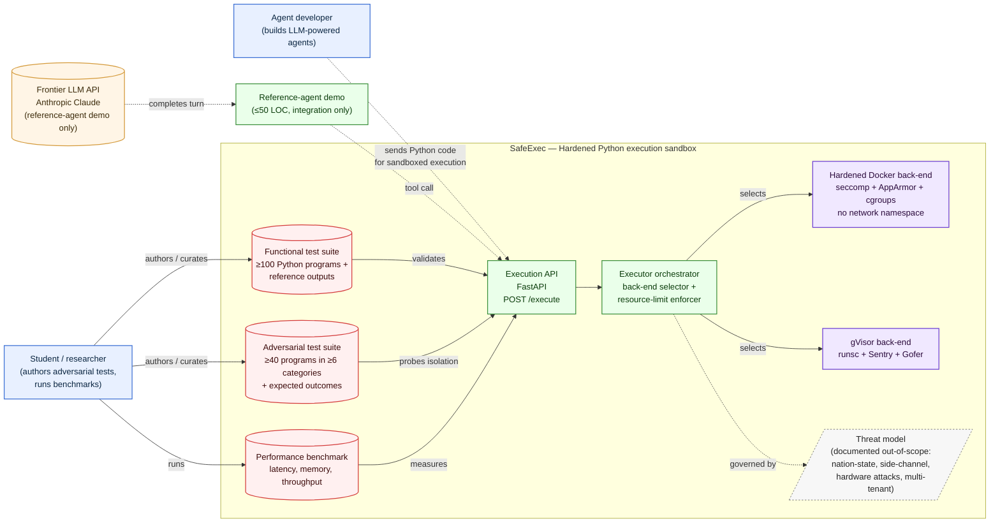

# Architecture / System Context — Week 1

> **AI-use disclosure.** Drafted with Claude Sonnet 4.6 (Cowork desktop app). AI-drafted, student-revised. Key human-authored decisions in this document: approval of every system-boundary line against charter §5; choice of Mermaid as the diagramming notation (suited to GitHub native rendering); PNG export for Canvas submission; the four "what this diagram commits the project to" load-bearing decisions. Full audit trail: [`docs/ai-use-log.md`](../ai-use-log.md).

Per the launch packet's "Tools (Machine, Architectures, Computational, and API)" requirement, this document supplies the W1 architecture/context evidence: one diagram and a short explanation of scope boundaries. Detailed component design happens in W4 (`docs/design/architecture.md`); this is the initial system-context view that the supervisor approves.

## System context diagram

> **Rendering note.** GitHub renders Mermaid natively in Markdown previews. For Canvas submission, the supervisor may prefer a static image — export via [mermaid.live](https://mermaid.live) (paste the code block above) and save as `architecture-context.svg` or `.png` in this directory, then link from the README. Student action: do this export before Canvas submission.

## Short explanation of scope boundaries

The diagram makes the W1 scope decisions visible at a glance. The reading is:

**Inside the SafeExec boundary** are the four classes of artifact this project actually produces: the API gateway, the executor orchestrator that selects an isolation back-end and applies resource limits, the two isolation back-ends themselves (hardened Docker, gVisor), and the three evaluation artifacts (functional test suite, adversarial test suite, performance benchmark) that exercise the boundary from outside. The threat-model document governs which behaviors the orchestrator and back-ends are obligated to prevent; it sits inside the boundary because it is a deliverable.

**Outside the boundary** sit two external actors (an agent developer, who is a *potential* consumer of the artifact, and the student, who is the builder and evaluator) and one external system (a frontier LLM API, present *only* to make the reference-agent demo runnable end-to-end). The reference-agent demo itself lives at the boundary — it is shipped with the project as integration evidence but is explicitly not the artifact.

**Explicitly excluded** from the diagram and therefore from the project: any network egress from the sandbox, any GPU back-end, any multi-tenant isolation between distinct users sharing one instance, any persistent-storage layer that outlives a request, any production-grade auth/TLS/rate-limiting, any non-Python language runtime, any Windows or macOS host. These are the same boundary lines stated in the project charter section 5; the diagram is the visual equivalent.

**Three evaluation flows are the project's central methodological story.** The functional suite probes "does correct code execute correctly," the adversarial suite probes "does incorrect or malicious code stay contained," and the benchmark probes "what does this cost in latency and memory." All three exercise the same external API; the orchestrator routes each request to one of the two back-ends, which lets the same suite produce a paired comparison. This is the architectural property that makes the back-end-comparison evaluation methodologically clean.

**What this diagram intentionally does not show.** Internal data flows between Sentry and Gofer inside gVisor, the seccomp filter inside the Docker container, the exact cgroup hierarchy. Those belong in the W4 component-level design document, not in a system-context view. Likewise, deployment topology (single host vs. fleet) and CI/CD plumbing are out of scope for the W1 view — they emerge later.

## What this diagram commits the project to

If the supervisor approves this diagram at W2 charter sign-off, the following are then load-bearing decisions:

1. **Two back-ends, not one.** The project's comparative-evaluation story depends on this. If implementation slips at W7, the fallback (per the charter risk register) is to drop gVisor; the diagram makes the W7 stop-and-cut decision visually concrete.
2. **A single execution API.** All three test suites and the demo agent talk through the same `/execute` endpoint. This is what makes the back-end swap "free" — no eval-suite changes are needed when adding gVisor in W7–W8.
3. **Threat model as a first-class deliverable.** It is drawn as a document inside the boundary, not as commentary, because the rubric weights ethics/security/broader-impact and the project's central contribution depends on this artifact existing.
4. **External LLM only for the demo.** The project does not depend on any third-party LLM provider for its core evaluation — those three test suites and the benchmark all run without API calls. This insulates the project's reproducibility from API outages, model deprecations, or pricing changes.
