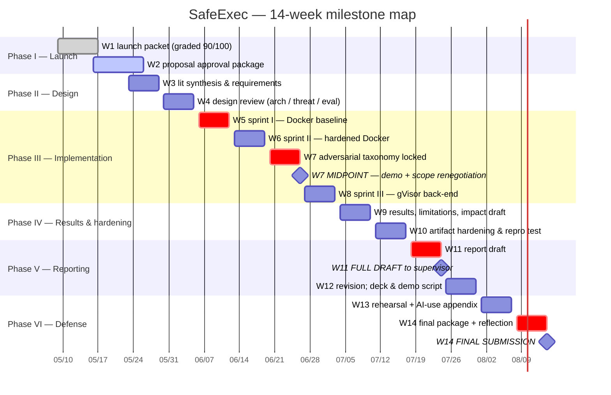

# Project Plan — SafeExec (W2 Proposal Approval Package, Appendix C)

> **AI-use disclosure.** Drafted with Claude Sonnet 4.6 (Cowork desktop app). AI-drafted, student-revised. Key human-authored decisions in this document: the explicit critical-path chain; the choice to make W7 the only scope-renegotiation point; every contingency-milestone trigger date; the four explicit relief valves. Full audit trail: [`docs/ai-use-log.md`](../ai-use-log.md).

This document is the project-plan appendix for the W2 Proposal Approval Package. It expands the proposal's §10 with the dependency view, the critical-path narrative, and the gantt-source in a form a grader can paste into mermaid.live or any Mermaid renderer.

## 1. Phase overview

The 14-week plan splits into six phases. Each phase has a fixed completion gate; the gate name and target date are in §3.

```
W1 - W2  | Phase I  — Launch         | scope locked, proposal approved
W3 - W4  | Phase II — Design         | architecture + threat model + eval plan approved
W5 - W6  | Phase III — Sprint I/II   | Docker baseline + hardened Docker
W7       | Phase III — MIDPOINT      | demo, taxonomy lock, scope-renegotiation gate
W8       | Phase III — Sprint III    | gVisor back-end + adversarial suite to ≥40
W9 - W10 | Phase IV — Results/harden | results draft + clean-VM repro test
W11- W12 | Phase V  — Reporting      | full draft to supervisor + revision cycle
W13- W14 | Phase VI — Defense        | rehearsal + final submission
```

## 2. Gantt (Mermaid source)



A static PNG export of this chart is stored at `screenshots/gantt.png` so Canvas graders without Mermaid rendering can view it directly. Re-run `scripts/render_gantt.py` whenever the chart changes.

## 3. Completion gates

| Gate | Week | Target date | Pass condition |
|---|---|---|---|
| G1: Proposal approval | W2 | 2026-05-26 | Supervisor returns approval block in `approval-brief.md` |
| G2: Design review approval | W4 | 2026-06-05 | `docs/design/architecture.md`, `threat-model.md`, `evaluation-plan.md` v1.0 accepted |
| G3: First execution | W5 | 2026-06-12 | `POST /execute` returns correct stdout for `print('hello world')` |
| G4: Midpoint demo | W7 | 2026-06-26 | ≥100 functional pass; ≥20 adversarial pass; taxonomy locked; supervisor reviews |
| G5: Full report draft | W11 | 2026-07-24 | Draft v0.9 delivered to supervisor |
| G6: Final submission | W14 | 2026-08-14 | Canvas final package complete |

## 4. Critical path

```
W2 G1 → W4 G2 → W5 G3 → W7 G4 → W8 (gVisor) → W11 G5 → W14 G6
```

Any slip on any node propagates downstream. The two named relief valves are:

- **W5 G3 (hello-world).** If missed, contingency at 2026-06-19 activates: W6 becomes "execution + hardening" combined; flagged as a W7 midpoint topic.
- **W7 G4 (midpoint).** The only sanctioned point for scope renegotiation. If functional <100 or adversarial <20, the W7 → W8 fallback is to drop gVisor and ship a Docker-only artifact, redirecting W8 effort to adversarial-suite expansion.

## 5. Dependency view

The dependencies between work packages are mostly serial through Phase III; the lateral dependencies live in the test corpora and the evaluation plan.

```mermaid
flowchart LR
    classDef gate fill:#e8f0ff,stroke:#3b6fd4,stroke-width:2px,color:#0a2540
    classDef impl fill:#eaffea,stroke:#3b8f3b,stroke-width:1.5px,color:#0a3b0a
    classDef test fill:#fff5e6,stroke:#d49a3b,stroke-width:1.5px,color:#3b2a0a
    classDef report fill:#f0e8ff,stroke:#6a3bd4,stroke-width:1.5px,color:#2a0a3b

    G1[("G1 W2 Proposal approval")]:::gate
    G2[("G2 W4 Design review approval")]:::gate
    G3[("G3 W5 First execution")]:::gate
    G4[("G4 W7 Midpoint demo")]:::gate
    G5[("G5 W11 Full draft")]:::gate
    G6[("G6 W14 Final submission")]:::gate

    Arch["W4 architecture.md"]:::impl
    Threat["W4 threat-model.md"]:::impl
    Eval["W4 evaluation-plan.md"]:::impl

    API["W5 src/api/ skeleton"]:::impl
    Dock["W5-W6 Docker back-end (baseline + hardened)"]:::impl
    Func["W5-W7 functional corpus (≥30 → ≥50 → ≥100)"]:::test
    Adv["W6-W8 adversarial corpus (≥10 → ≥20 → ≥40)"]:::test
    GVis["W8 gVisor back-end"]:::impl
    Bench["W8-W9 performance harness + sweep"]:::test

    Results["W9 results, limitations, impact draft"]:::report
    Repro["W10 reproducibility self-test on clean VM"]:::impl
    Draft["W11 full report draft"]:::report
    Revise["W12 revision; deck + demo script"]:::report
    Rehearse["W13 rehearsal + AI-use appendix"]:::report
    Final["W14 final package"]:::report

    G1 --> Arch --> G2
    G1 --> Threat --> G2
    G1 --> Eval --> G2

    G2 --> API
    API --> Dock --> G3
    G2 --> Func
    Func --> G3
    Dock --> Adv
    Adv --> G4
    Func --> G4
    G4 --> GVis
    GVis --> Bench
    Adv --> Bench
    Func --> Bench
    Bench --> Results --> Repro --> Draft --> G5
    G5 --> Revise --> Rehearse --> Final --> G6
```



## 6. Resource plan

| Resource | Availability | Use across the term |
|---|---|---|
| Student wall-clock | ~17 hrs/week, 14 weeks → ~235 hours | Front-loaded W5–W8 (~40+25 hrs implementation); W11 (~30 hrs draft); W12 (~20 hrs revision) |
| DigitalOcean droplet | 24/7, billed monthly | Active development W5–W14; idle W1–W4 (~$32/mo × 4) |
| Anthropic API budget | $30–$50 | Reference-agent demo only; Haiku during dev, Sonnet for final |
| Supervisor time | W2 approval, W7 midpoint, W11 draft feedback + fortnightly check-ins | Three named milestones plus check-ins |

Total wall-clock effort estimate from the W1 feasibility memo: ~235 student-hours across 14 weeks, ≈17 hrs/week. Consistent with a 3-credit graduate applied-project workload. If actual availability falls materially below this, the W7 scope-reduction trigger is the relief valve.

## 7. Communication and review cadence

| Cadence | Audience | Channel | Purpose |
|---|---|---|---|
| Weekly | Self | `engineering-log.md` | Process evidence; one entry per working session |
| Fortnightly | Supervisor | 30-min check-in | Status, blockers, scope concerns; cadence proposed in supervisor-briefing |
| W2, W7, W11 | Supervisor | Longer dedicated session | Proposal approval; midpoint scope-renegotiation; draft feedback |
| W13 | Self + supervisor (optional) | Rehearsal recording | Presentation rehearsal; ≤20 minutes |
| Continuous | Public | GitHub commits + Issues | Process evidence; reproducibility |

## 8. What changes after W2 supervisor approval

Once the supervisor returns the approval block in `approval-brief.md`:

1. The `Status` column in `README.md` updates from `In progress` to `Approved` for Phase I.
2. `docs/01-launch-packet/project-charter.md` gets a top-of-file note: *"Superseded by `docs/02-proposal-package/proposal.md` v1.0 (approved YYYY-MM-DD). Retained for W1 historical record."*
3. The W3 work begins: lit-synthesis expansion and requirements-document drafting.
4. Any conditional approval items are tracked in `approval-brief.md` "Conditional items" and resolved before W4 begins.

If approval is delayed past 2026-05-29 (end of W3), the project begins W3 lit-synthesis on the assumption of approval and revises the requirements scope if approval comes back with material changes — same approach as planned in the W1 supervisor briefing.

---

*End of project plan.*
