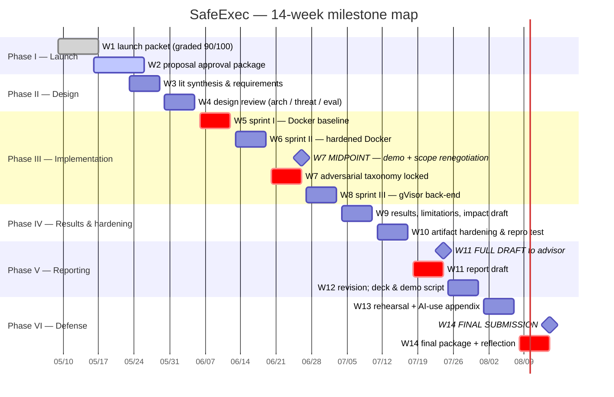

# Project Proposal — SafeExec

**A Hardened, Threat-Modeled Python Execution Sandbox for LLM-Agent Tool-Use**

> **AI-use disclosure.** Drafted with Claude Sonnet 4.6 (Cowork desktop app). AI-drafted, student-revised. Key human-authored decisions in this document: every scope boundary in §8; every numeric success-criterion threshold in §7; every risk likelihood/impact rating and mitigation owner assignment in §12; the W7 explicit scope-renegotiation checkpoint as the project's load-bearing relief valve; the contingency milestone dates added in §10.5; the framing of the adversarial test suite as the project's intellectual contribution. Full audit trail: [`docs/ai-use-log.md`](../ai-use-log.md).

---

## Document control

| Field | Value |
|---|---|
| Document | CISC 699 Proposal Approval Package (Hard Stop 1) |
| Working title | SafeExec |
| Student | Zixuan Liang (zliang1@my.harrisburgu.edu) |
| Program | M.S. Computer Information Sciences, Harrisburg University |
| Course | CISC 699-50-A-2026/Summer — Applied Project in Computer Information Sciences |
| Project advisor | Prof. Khalid Lateef |
| Course instructor | Dr. Majid Shaalan |
| Term | 2026-05-09 → 2026-08-14 (14 weeks) |
| Proposal version | 1.0 |
| Proposal date | 2026-05-21 |
| Submission target | 2026-05-24 (Canvas, before 11:59pm ET) |
| Approval target | 2026-05-26 (post advisor review) |
| Supersedes | `docs/01-launch-packet/project-charter.md` (W1 charter; retained as historical record) |

---

## 1. Executive summary

LLM-powered software agents — Claude Code, Code Interpreter, Cursor, Devin, and a growing open-source ecosystem — increasingly execute model-generated Python code as part of their tool-use loop. In production, that execution layer is the part most often built quickly and revisited never; the open-source landscape today consists of either heavyweight commercial platforms or lightweight wrappers with weak isolation guarantees and no published threat models tied to reproducible benchmarks. SafeExec closes a measurable slice of that gap. It is a small HTTP execution service that accepts Python source and runs it inside an isolated environment, with two pluggable isolation back-ends — a hardened Docker configuration and a gVisor-backed configuration — exposed through a single `POST /execute` API. The intellectual contribution is a curated **adversarial test suite** of ≥40 programs across ≥6 categories with documented expected-contained-outcome labels, plus an empirical comparison of isolation strength and performance overhead across the two back-ends, reported with 95% confidence intervals. The artifact ships with a documented threat model, ≥100 functional test programs, a performance benchmark harness, reproducibility materials (pinned Dockerfiles, Makefile targets, deterministic test runner), a minimal reference agent for end-to-end demo, and a 15–25 page graduate-level technical report. Project advisor approval is requested at the scope described in §8.

## 2. Background and significance

### 2.1 Why this problem matters now

Agentic systems built on large language models rely on a tool-use loop in which the model proposes code, an executor runs it, and the result is fed back into the model's next step. The executor is the layer at which model-generated text becomes program execution on real infrastructure. Today's open-source agents commonly execute model output with isolation that ranges from "an unsandboxed subprocess inside the agent's own process tree" to "a Docker container with default settings and a permissive network policy." Neither is a defensible posture when the code being executed was produced by a language model under conditions of possible prompt injection.

This is not a hypothetical concern. The 2025 NIST AI 100-2 update [1] and the 2025 OWASP Top 10 for LLM Applications [2] both identify tool-execution isolation as an under-specified mitigation surface, with OWASP LLM05 ("Improper Output Handling") and LLM06 ("Excessive Agency") naming sandboxed execution explicitly as a standard mitigation. Real-world container-escape vulnerabilities continue to be discovered in widely deployed runtimes (CVE-2019-5736 [7], CVE-2024-21626), confirming that "default Docker" is not a defensible isolation posture against adversarial code.

### 2.2 What already exists, and where the gap is

Closed-source services (Anthropic's analysis tool, OpenAI's Code Interpreter) address these risks behind opaque infrastructure and publish almost nothing about their isolation models. The open-source landscape consists of one strong commercial-backed option — E2B, which uses Firecracker microVMs [5] — and a handful of lighter-weight projects that ship convenience but not measured isolation strength. None of the open-source projects in this space publishes a documented threat model tied to a reproducible adversarial benchmark. That is the specific gap this project addresses: not a new isolation primitive, but a **measurement framework** that lets the isolation strength of a sandbox be evaluated empirically rather than asserted.

### 2.3 Why this is appropriate for CISC 699

The problem produces all the components a CISC 699 applied project must produce: (a) a working computational artifact with non-trivial systems content, (b) an empirical evaluation with explicit statistical structure, (c) a defensible ethics/security/broader-impact story grounded in named standards (NIST AI 100-2, OWASP LLM Top 10), and (d) reproducibility artifacts that can be exercised by a reader on commodity hardware. It is bounded enough that a single graduate student can credibly close the named gap in fourteen weeks (Python-only, single-tenant, no network, no GPU), and it is *not* a tutorial replication — the adversarial suite and its methodology are original work.

## 3. Problem statement

LLM-powered software agents execute model-generated Python code with isolation primitives that were not designed for adversarial workloads. The open-source landscape lacks a code-execution sandbox that pairs (a) production-realistic isolation with (b) a documented threat model and (c) a reproducible adversarial benchmark that lets isolation strength be measured. SafeExec builds that sandbox for the narrowly scoped case of Python-only, single-tenant, no-network, no-GPU workloads on a Linux host, and contributes the threat model and adversarial benchmark as the project's central intellectual artifact.

**What the project explicitly does *not* claim to solve.** Defense against nation-state-grade adversaries, side-channel timing attacks, Spectre/Meltdown-class or hardware-level attacks, multi-tenant security between mutually distrusting users sharing one instance, network-level isolation for agents that legitimately need outbound network access, GPU-accelerated workload sandboxing, and replacement for trained-model alignment or input-validation defenses. The sandbox is the last line, not the only line.

## 4. Research questions and hypotheses

The project is framed by three measurable research questions. Each is paired with a hypothesis stated in advance so that the W9 results section can report whether the hypothesis was supported, refuted, or returned a null result.

| # | Research question | Hypothesis | How it will be tested |
|---|---|---|---|
| RQ1 | How does isolation strength differ between hardened-Docker and gVisor back-ends when measured against a curated adversarial suite? | gVisor will contain ≥5 percentage points more of adversarial programs than hardened Docker, with the difference concentrated in syscall-abuse and host-enumeration categories. | Adversarial suite (≥40 programs, ≥6 categories) run under each back-end; contained-outcome labels compared per program. |
| RQ2 | What is the performance overhead of stronger isolation, measured as steady-state per-request latency on the functional suite? | gVisor will impose a 1.5–4× latency penalty over hardened Docker for short-running Python programs, consistent with prior gVisor case studies. | Performance benchmark sweep on the functional suite under each back-end; ≥30 samples per condition; 95% confidence intervals on the median. |
| RQ3 | Is the trade-off between isolation strength (RQ1) and overhead (RQ2) navigable by configuration, or is it a hard choice? | The two back-ends will occupy distinct points on the isolation-vs-overhead curve, not a Pareto-equivalent region — i.e., there is a real trade-off, not a configuration mistake. | Joint plot of contained-outcome rate and median latency for both back-ends; visual inspection plus reported per-category breakdown. |

The hypotheses are deliberately pre-registered. Null results (e.g., gVisor not significantly stronger on the adversarial suite, or overhead inside noise) will be reported as findings rather than failures, per the W9 plan in §10.

## 5. Objectives

### 5.1 Primary objectives

1. Deliver a working sandbox execution service with the two named isolation back-ends, satisfying the functional suite at ≥99%.
2. Author and publish an adversarial test suite of ≥40 programs across ≥6 categories with documented expected contained-outcome labels.
3. Produce an empirical isolation-vs-overhead comparison across the two back-ends with statistical confidence intervals (95% CI, ≥30 samples per condition).
4. Produce a 15–25-page graduate-level technical report meeting Level 1 (Advanced/Exceptional) on all rubric dimensions.

### 5.2 Secondary objectives

5. Document a threat model that names the adversary capabilities the sandbox defends against and the ones it does not.
6. Ship a minimal Claude-API-driven reference agent demonstrating end-to-end tool-use integration.
7. Maintain reproducibility such that a reader on a stock Ubuntu 22.04/24.04 host can execute `make setup && make test && make bench` and obtain reported numbers within ±10%.

### 5.3 Stretch objectives (only if ahead at W10)

8. Add a Firecracker microVM back-end as a third comparison point (per [4]).
9. Release the adversarial benchmark as a standalone open-source artifact with its own README and citation.

## 6. Intended artifact

The project delivers a single integrated artifact comprising ten components, each tied to one or more objectives in §5.

| # | Component | Repo path | Maps to objective |
|---|---|---|---|
| A1 | Sandbox execution service | `src/` | O1, O6 |
| A2 | Hardened Docker back-end (W5–W6) | `src/backends/docker_hardened/` | O1, O5 |
| A3 | gVisor back-end (W7–W8) | `src/backends/gvisor/` | O1, O5 |
| A4 | Threat model document | `docs/design/threat-model.md` | O5 |
| A5 | Functional test suite (≥100 programs) | `tests/functional/` | O1 |
| A6 | Adversarial test suite (≥40 programs, ≥6 categories) | `tests/adversarial/` | O2 — **central contribution** |
| A7 | Performance benchmark harness | `benchmarks/` | O3 |
| A8 | Minimal reference agent | `scripts/demo_agent.py` | O6 |
| A9 | Reproducibility materials (Dockerfiles, compose, Makefile, runner) | `deploy/`, `scripts/`, root | O7 |
| A10 | Final technical report | `docs/reports/final-report.md` (15–25pp + appendices) | O4 |

## 7. Success criteria (measurable)

Per the W2 rubric expectation that success criteria be measurable indicators, every named criterion below has either a quantified threshold, a comparison baseline, or a stakeholder acceptance gate.

### 7.1 Functional correctness

| Indicator | Threshold | Measurement |
|---|---|---|
| Functional-suite pass rate (Docker back-end) | ≥99% of ≥100 programs | Output byte-equality against reference Python 3.11 interpreter |
| Functional-suite pass rate (gVisor back-end) | ≥99% of ≥100 programs | Same; deviations recorded as known compatibility limitations |
| Reference-interpreter agreement | Exact match for stdout, stderr, exit code | Deterministic test runner with fixed RNG seeds |

### 7.2 Isolation strength

| Indicator | Threshold | Measurement |
|---|---|---|
| Adversarial-suite contained-outcome rate (Docker) | ≥90% of ≥40 programs | Per-program contained / not-contained label per spec |
| Adversarial-suite contained-outcome rate (gVisor) | ≥95% of ≥40 programs | Same |
| Category coverage | ≥6 distinct categories | Resource exhaustion, fd exhaustion, fork bombs, syscall abuse, attempted persistence, host enumeration, exfiltration attempts |
| Per-category sample size | ≥5 programs/category | Audit at W7 midpoint |

### 7.3 Performance overhead

| Indicator | Threshold | Measurement |
|---|---|---|
| Cold-start latency (Docker) | Reported median + 95% CI | ≥30 samples per condition |
| Warm-start latency (Docker) | Reported median + 95% CI | ≥30 samples per condition |
| Cold/warm-start latency (gVisor) | Reported median + 95% CI | ≥30 samples per condition |
| Steady-state per-request latency | Reported median + 95% CI per back-end | ≥30 samples per condition |
| Memory overhead | Peak RSS reported per back-end | Recorded from cgroup memory accounting |
| Cross-back-end overhead ratio | Reported explicitly with interpretation | Joint plot of contained-rate vs latency |

### 7.4 Reproducibility

| Indicator | Threshold | Measurement |
|---|---|---|
| Clean-VM repro time | Single graduate-level reader, ≤90 minutes from clone to first benchmark output | Self-test on a fresh DigitalOcean droplet at W10 |
| Numeric agreement | Reported numbers within ±10% on equivalent hardware | Re-run on second droplet, document hardware specs |
| Setup commands | `make setup && make test && make bench` succeeds end-to-end | CI-equivalent run logged in `benchmarks/results/` |

### 7.5 Communication

| Indicator | Threshold | Measurement |
|---|---|---|
| Final report rubric dimension scores | Level 1 (Advanced/Exceptional, 90–100%) on all RU-01 dimensions | Self-assessment + advisor feedback at W11 |
| Final presentation runtime | ≤20 minutes | Rehearsal at W13 |
| Live demo runtime | ≤5 minutes | Rehearsal at W13 |

### 7.6 Process

| Indicator | Threshold | Measurement |
|---|---|---|
| Engineering log cadence | ≥1 entry per week W1→W14 | `engineering-log.md` |
| Annotated bibliography count | ≥15 sources by W11 | `docs/01-launch-packet/annotated-bibliography.md` |
| AI-use log completeness | Entry per substantive AI-assisted artifact | `docs/ai-use-log.md`; audit-table format |
| AI-use appendix consolidation | Final appendix assembled by W13 | `docs/reports/final-report.md` appendix |

## 8. Scope

### 8.1 In scope

- Python 3.11 user code execution.
- Synchronous request/response API (`POST /execute`).
- Ephemeral per-request filesystem.
- Resource limits: CPU, memory, wall-clock, PIDs, file descriptors.
- Two isolation back-ends: hardened Docker, gVisor.
- Linux host (Ubuntu 22.04 or 24.04 LTS, x86-64).
- Functional, adversarial, and performance test suites.
- Documented threat model.
- Minimal reference agent for demo only (≤50 LOC).

### 8.2 Out of scope (explicitly)

- Multi-language support beyond Python (no JavaScript, R, bash, etc.).
- Network access from inside the sandbox.
- GPU access.
- Persistent state or sessions across requests.
- Multi-tenant security (mutually distrusting users on one instance).
- Production-grade deployment hardening: TLS, authentication, rate limiting beyond demo-grade.
- Windows or macOS hosts.
- Distributed scheduling, Kubernetes operators, production orchestration.
- Firecracker back-end (stretch only, W10).
- Side-channel timing attacks, Spectre/Meltdown-class attacks, hardware attacks.
- Defenses against nation-state-grade adversaries.

### 8.3 Scope-fence policy

The scope above is fixed for the duration of W3–W8. Any proposed change must be reviewed against the milestone map and approved by the advisor in writing. The W7 midpoint review is the explicit checkpoint for scope renegotiation; outside of that checkpoint, the default is no change. Scope-fence violations are tracked as risk R1 in §12.

## 9. Technical feasibility — MACP framing

This section maps the project to the rubric's MACP framing — Machine, Architectures, Computational method, API integration. The detail here is the W2 evidence that the technical feasibility has been thought through across all four layers.

### 9.1 Machine

| Concern | Choice | Rationale |
|---|---|---|
| Authoring environment | Local laptop (macOS); PyCharm IDE; iCloud + Git for backup | Stable, already provisioned |
| Test/runtime environment | DigitalOcean Premium Intel droplet, NYC3, 2 vCPU / 4 GB / 120 GB NVMe, Ubuntu 22.04.5 LTS, kernel 5.15.0-179-generic | Provisioned 2026-05-17; Docker 29.5.0 and `runsc` release-20260511.0 installed and verified |
| Total compute budget envelope | ~$150–$250 across 14 weeks | Within charter's $200–$400 ceiling; preserves buffer |
| Backup compute path | Local Ubuntu VM via UTM/QEMU on the laptop | Activated if droplet has an outage during a milestone week |
| Hardware reproducibility | x86-64 only; ARM Macs run sandbox-of-sandbox via UTM (not officially supported) | Documented in README under "Tested platforms"; gVisor on macOS is unofficial |

**Evidence to attach to the W2 proposal:** screenshot of the droplet's `uname -r`, `cat /etc/os-release`, `docker version`, and `runsc --version` output (already captured in `engineering-log.md` W1 entry of 2026-05-17).

### 9.2 Architectures

The system-context architecture (`docs/01-launch-packet/architecture-context.md`, exported PNG at `docs/01-launch-packet/screenshots/05-architecture-rendered.png`) shows the SafeExec boundary, the two external actors (agent developer, student), the one external dependency (a frontier LLM API, used only by the reference-agent demo), and the three evaluation flows (functional, adversarial, performance) that all probe the same `POST /execute` API.

The architecture commits the project to four load-bearing decisions:

1. **Two back-ends, not one.** The comparative-evaluation story depends on this. The W7 stop-and-cut decision (per the risk register, R4) is the explicit relief valve if implementation slips.
2. **A single execution API.** All three test suites and the demo agent talk through `POST /execute`. This is what makes the back-end swap free — no eval-suite changes are needed when adding gVisor in W7–W8.
3. **Threat model as a first-class deliverable.** It is drawn inside the boundary because the project's central contribution depends on this document existing.
4. **External LLM only for the demo.** The three test suites and the benchmark run without API calls, insulating reproducibility from API outages, model deprecations, or pricing changes.

The detailed component-level design (Sentry/Gofer flows inside gVisor, seccomp filter inside Docker, cgroup hierarchy, request lifecycle) is W4 work, captured in `docs/design/architecture.md` per the milestone map.

### 9.3 Computational method

| Layer | Method family | Tooling |
|---|---|---|
| Isolation back-ends | OS-level container isolation (hardened Docker) and user-space syscall interposition (gVisor / `runsc`) [3] | Docker Engine 29.5.0, `runsc` release-20260511.0 |
| Execution API | Synchronous HTTP service; pluggable executor interface | FastAPI 0.110+, uvicorn 0.29+ |
| Resource enforcement | cgroups v2 (memory, CPU, PIDs, fd); wall-clock kill via supervisor timer | Linux kernel primitives; Python `asyncio.wait_for` for the wall-clock timer |
| Functional evaluation | Deterministic output comparison (byte-equality of stdout/stderr/exit-code against CPython 3.11 reference) | `pytest`; HumanEval + hand-authored corpus |
| Adversarial evaluation | Per-program contained-outcome labels assigned in advance; back-end run produces observed outcome; comparison yields contained/not-contained per program | `pytest`; hand-authored adversarial programs informed by [7] and CVE case studies |
| Performance evaluation | Repeated-trial latency benchmark; ≥30 samples per condition; bootstrap or t-based 95% CI on the median | `pytest-benchmark` or `hyperfine` |
| Reproducibility | Pinned dependencies, deterministic test runner (fixed seeds, fixed iteration count), single setup script | `requirements.txt` + lockfile; `deploy/setup.sh`; `Makefile` |

The methodological model for deterministic graders is SWE-bench [6]: a test-execution-based grader that requires no human judgement on outputs.

### 9.4 API / external integrations

| Integration | Use | Auth | Quota / cost | Risk |
|---|---|---|---|---|
| Anthropic Claude API (Sonnet 4.6 default; Haiku for dev) | Reference-agent demo only (≤50 LOC) | API key in `.env` (gitignored) | Budget cap ~$30–$50 across 14 weeks; switch to Haiku if needed | API outage during W14 demo → fallback to pre-recorded transcript |
| Docker Hub | Pull base images during `make setup` | Anonymous; rate-limited | Free tier covers project use | Rate limit → pre-pull and cache images on droplet |
| GitHub | Source control, issue tracking, public release at W14 | SSH key | Free for public repos | Repository takedown → mirror on GitLab; tagged commits backed up locally |
| HumanEval corpus | Functional test seed (subset) | None | MIT-licensed redistribution | License drift → fall back to fully hand-authored corpus |
| MBPP corpus | Optional functional test seed (subset) | None | CC-BY-4.0 | Same |
| gVisor apt repository | `runsc` install on droplet | Anonymous; signed apt repo | Free | Repo change → pin to a downloaded `.deb` |

No third-party SaaS is in scope beyond the four named above. The reference-agent demo's failure mode is explicitly accounted for in §12 R6 and §10.5 contingency notes.

## 10. Project plan

### 10.1 Phases and dependency order

The plan splits the 14 weeks into six phases. Each phase has a fixed completion gate that must pass before the next phase starts; the gate is named in §10.2.

1. **Phase I — Launch (W1–W2).** Proposal approval, scope finalization.
2. **Phase II — Design (W3–W4).** Lit synthesis, requirements, architecture, threat model, evaluation plan.
3. **Phase III — Implementation sprints (W5–W8).** Docker back-end, hardened Docker, gVisor back-end. Functional and adversarial suites grown in parallel.
4. **Phase IV — Results and hardening (W9–W10).** Results, limitations, broader impact draft; artifact hardening; reproducibility self-test on a clean VM.
5. **Phase V — Reporting (W11–W12).** Full report draft to advisor; revision cycle; deck and demo script.
6. **Phase VI — Defense (W13–W14).** Presentation rehearsal; final package; submission and reflection.

Hard checkpoints are W2 (proposal approval), W5 (first hello-world execution), W7 (midpoint demo and explicit scope renegotiation), W11 (full draft for advisor feedback), and W13 (no new feature work).

### 10.2 Milestone table (aligned to course hard stops)

| Week | Date range | Deliverable | Completion gate | Phase |
|---|---|---|---|---|
| W1 | 2026-05-09 → 2026-05-15 | Launch packet | Submitted to Canvas 2026-05-17; graded 90/100 | I |
| W2 | 2026-05-16 → 2026-05-22 | **This proposal-approval package** | Submitted to Canvas by 2026-05-24 11:59pm; approved by 2026-05-26 | I |
| W3 | 2026-05-23 → 2026-05-29 | Lit synthesis; requirements & use cases | `docs/design/requirements.md` v1.0 | II |
| W4 | 2026-05-30 → 2026-06-05 | Design review (architecture + threat model + evaluation plan) | `docs/design/architecture.md`, `threat-model.md`, `evaluation-plan.md` v1.0 | II |
| W5 | 2026-06-06 → 2026-06-12 | Implementation sprint I — Docker back-end, basic API | First end-to-end "hello world" Python execution via `POST /execute` | III |
| W6 | 2026-06-13 → 2026-06-19 | Implementation sprint II — hardened Docker | Seccomp + AppArmor + cgroups + read-only rootfs; ≥50 functional programs pass | III |
| W7 | 2026-06-20 → 2026-06-26 | **Midpoint demo / scope renegotiation** | Functional ≥100; adversarial taxonomy locked; ≥20 adversarial programs run | III |
| W8 | 2026-06-27 → 2026-07-03 | Implementation sprint III — gVisor back-end | gVisor back-end fully integrated; ≥40 adversarial programs across ≥6 categories | III |
| W9 | 2026-07-04 → 2026-07-10 | Results, limitations, broader-impact draft | First full results table; W9 results section drafted | IV |
| W10 | 2026-07-11 → 2026-07-17 | Artifact hardening; reproducibility self-test | Clean-droplet repro within ±10% of dev-droplet numbers | IV |
| W11 | 2026-07-18 → 2026-07-24 | Full report draft to advisor | `docs/reports/final-report.md` v0.9, ≥15-page main body, bibliography ≥15 sources | V |
| W12 | 2026-07-25 → 2026-07-31 | Revision cycle; deck + demo script | Final report v1.0; slide deck v0.9 | V |
| W13 | 2026-08-01 → 2026-08-07 | Presentation rehearsal; AI-use appendix | Rehearsal ≤20 min; AI-use appendix consolidated from `docs/ai-use-log.md` | VI |
| W14 | 2026-08-08 → 2026-08-14 | Final submission + reflection | Canvas final package: report PDF, repo link, slides, demo recording | VI |

### 10.3 Gantt view



A rendered PNG of this Gantt is exported to `docs/02-proposal-package/screenshots/gantt.png` for graders who do not have Mermaid rendering. A dependency-graph view is provided in `project-plan.md` for the critical-path view (W2 → W4 → W5 → W7 → W8 → W11 → W14).

### 10.4 Critical path

The critical-path chain is: **W2 proposal approval → W4 design review approval → W5 first execution → W7 midpoint scope decision → W8 gVisor integration → W11 full draft → W14 final submission.** Any slippage on any link is a slip risk for the deliverable. Two relief valves are built in: (a) the W5 hello-world checkpoint, which if missed triggers the W7 fallback (drop gVisor, ship Docker-only) per risk R4; (b) the W7 midpoint review, which is the only point at which scope can be renegotiated without advisor sign-off.

### 10.5 Contingency milestones

Per the W1 grading-feedback list and the W2 rubric expectation that "milestones, sequencing, and realistic timing" be visible, this proposal names explicit contingency milestones — fallback dates that activate if a primary milestone slips by more than 7 days.

| Trigger | Primary milestone | Contingency milestone | Effect |
|---|---|---|---|
| Hello-world execution misses W5 gate (2026-06-12) | W5 sprint I | 2026-06-19 (end of W6) | Defer hardening to W7; treat W6 as combined "first execution + first hardening"; raise as a W7 midpoint topic |
| W7 midpoint shows <50 functional programs or <10 adversarial programs working | W7 midpoint demo (2026-06-26) | 2026-07-03 (end of W8) | Scope fallback: drop gVisor; ship Docker-only artifact; redirect W8 to adversarial-suite expansion |
| Adversarial taxonomy not lockable by W7 | W7 taxonomy lock | 2026-07-03 | Use the working subset (≥6 categories, ≥5 each) as the locked taxonomy; document the gaps as known limitations |
| W11 full draft not deliverable to advisor by 2026-07-24 | W11 draft | 2026-07-28 (early W12) | Compresses the W12 revision window; flag explicitly to advisor; submit a partial draft with named placeholders rather than missing the gate |
| Reproducibility self-test fails on clean VM at W10 | W10 repro gate | 2026-07-21 (mid-W11) | Add a "Reproducibility caveats" section in the report and document the specific failure mode; rerun on a third VM before W14 |

These contingency dates are not invitations to slip; they are pre-committed responses if slippage occurs, named here so the response is not improvised under pressure.

## 11. Work breakdown structure (WBS)

A lightweight WBS lives in [`wbs.md`](wbs.md). Every leaf task maps to a week, to a deliverable, and to a success criterion in §7. The summary table is included here so the proposal is self-contained; the working backlog and per-task issue links live in `wbs.md`.

| WBS ID | Task | Week(s) | Deliverable | Success criterion |
|---|---|---|---|---|
| WBS-1.1 | Submit W1 launch packet | W1 | Canvas submission | §7.6 process |
| WBS-1.2 | Strengthen AI-use log (post-feedback) | W2 | `docs/ai-use-log.md` audit table | §7.6 process |
| WBS-1.3 | Draft and submit this proposal-approval package | W2 | Canvas submission, this document | §7.5 communication, §7.6 process |
| WBS-1.4 | Record walkthrough video | W2 | `walkthrough-script.md` + video file | §7.5 communication |
| WBS-2.1 | Lit synthesis (bibliography → ≥10) | W3 | `docs/design/related-work.md` | §7.6 process |
| WBS-2.2 | Requirements & use cases | W3 | `docs/design/requirements.md` | §7.5 communication |
| WBS-2.3 | Architecture detailed design | W4 | `docs/design/architecture.md` | §7.1 functional |
| WBS-2.4 | Threat model | W4 | `docs/design/threat-model.md` | §7.2 isolation |
| WBS-2.5 | Evaluation plan | W4 | `docs/design/evaluation-plan.md` | §7.1–§7.4 |
| WBS-3.1 | Implement execution API skeleton | W5 | `src/api/` first commit | §7.1 functional |
| WBS-3.2 | Implement Docker back-end (baseline) | W5 | First end-to-end Python execution | §7.1 functional |
| WBS-3.3 | Functional corpus seed (≥30 programs) | W5 | `tests/functional/` | §7.1 functional |
| WBS-3.4 | Harden Docker back-end (seccomp + AppArmor + cgroups) | W6 | Hardened back-end commits | §7.2 isolation |
| WBS-3.5 | Functional corpus to ≥50 programs | W6 | `tests/functional/` | §7.1 functional |
| WBS-3.6 | Adversarial corpus seed (≥10 programs, ≥3 categories) | W6 | `tests/adversarial/` | §7.2 isolation |
| WBS-3.7 | Functional corpus to ≥100 programs | W7 | `tests/functional/` | §7.1 functional |
| WBS-3.8 | Adversarial taxonomy locked; ≥20 programs | W7 | `tests/adversarial/` README; `docs/design/threat-model.md` | §7.2 isolation |
| WBS-3.9 | Midpoint demo + scope renegotiation | W7 | Demo recording; advisor decision log | §7.5 communication |
| WBS-3.10 | gVisor back-end integration | W8 | gVisor commits; both back-ends executable | §7.2 isolation |
| WBS-3.11 | Adversarial corpus to ≥40 programs across ≥6 categories | W8 | `tests/adversarial/` | §7.2 isolation |
| WBS-3.12 | Performance benchmark harness | W8 | `benchmarks/` first sweep results | §7.3 performance |
| WBS-4.1 | Run full performance sweep on both back-ends | W9 | `benchmarks/results/` tables | §7.3 performance |
| WBS-4.2 | Results, limitations, broader-impact draft | W9 | Report sections drafted | §7.5 communication |
| WBS-4.3 | Reproducibility materials (README, Makefile, setup.sh) | W10 | `deploy/`, root | §7.4 reproducibility |
| WBS-4.4 | Clean-VM reproducibility self-test | W10 | Fresh droplet results within ±10% | §7.4 reproducibility |
| WBS-5.1 | Full report draft to advisor | W11 | `docs/reports/final-report.md` v0.9 | §7.5 communication |
| WBS-5.2 | Bibliography to ≥15 sources | W11 | Annotated bibliography | §7.6 process |
| WBS-5.3 | Revision cycle on advisor feedback | W12 | Final report v1.0 | §7.5 communication |
| WBS-5.4 | Slide deck + demo script | W12 | Slides v0.9 | §7.5 communication |
| WBS-6.1 | Presentation rehearsal | W13 | Rehearsal ≤20 min | §7.5 communication |
| WBS-6.2 | AI-use appendix consolidated | W13 | Report appendix | §7.6 process |
| WBS-6.3 | Final submission package | W14 | Canvas final upload | §7.5 communication, §7.6 process |

Every WBS task maps to at least one success criterion in §7. The instructor's "every task can be traced to a success criterion" self-check is satisfied.

## 12. Risk register

The risk register is formal — each row has a likelihood, impact, mitigation, mitigation owner, and named contingency.

| # | Risk | Likelihood | Impact | Mitigation | Owner | Contingency if mitigation fails |
|---|---|---|---|---|---|---|
| R1 | Scope creep into multi-language or persistence features | Medium | High | Hard scope-fence in this proposal; W7 explicit scope-renegotiation checkpoint | Student | Drop scope-creep additions; document as "explored but not pursued" |
| R2 | gVisor performance penalty too variable for meaningful comparison | Medium | Medium | Benchmark protocol defined in W4 (`evaluation-plan.md`); pre-registered sample sizes; percentile + 95% CI reporting | Student | Report null result as a finding with per-percentile breakdown |
| R3 | Adversarial suite too small or unrepresentative | Medium | High | Category taxonomy locked at W3–W4 design phase; commit to ≥40 programs across ≥6 categories; midpoint peer review with advisor | Student + Advisor | Ship the ≥6 categories at lower per-category counts; document gaps in §"Limitations" |
| R4 | Time loss to container-runtime debugging | Medium | Medium | W5 hard hello-world deadline; if missed, contingency 2026-06-19 activates; W7 fallback is Docker-only | Student | Drop gVisor to stretch; release Docker-only artifact; reframe §RQ1 around configuration variants of Docker |
| R5 | Linux host/kernel mismatch between dev and grading environments | Low | Medium | Pin Ubuntu 22.04 LTS; document in README; test on fresh droplet at W10 | Student | Provide a pre-built Docker image of the host environment as fallback |
| R6 | API cost overrun on Anthropic Claude (reference-agent demo) | Low | Low | Cap demo runs; cache transcripts; switch to Haiku during development | Student | Replay pre-recorded transcripts; skip live LLM-call in the W14 demo |
| R7 | AI-use disclosure gaps if log is not kept current | Low | High | Update `docs/ai-use-log.md` at end of every AI-assisted session; commit-message `AI-use:` trailer; weekly audit during W11 drafting | Student | Reconstruct from chat history before W13 freeze; flag any unrecoverable gaps in the W14 reflection |
| R8 | Advisor expectations diverge from this proposal | Low | High | W2 explicit approval gate; this proposal lists conditional items in `approval-brief.md`; W7 midpoint review | Student + Advisor | Adjust at W7; document the divergence in the engineering log |
| R9 | Reproducibility fails for the grader (e.g., they cannot run Docker) | Low | Medium | Recorded demo + pre-rendered result tables as fallback; document hardware/host requirements in README | Student | Make the pre-recorded demo and result tables primary artifacts; flag the repro caveat in the report |
| R10 | Negative or null result in performance comparison | Medium | Low | Plan W9 results section to interpret null results as findings (per RQ pre-registration) | Student | Frame the null result as the headline finding; relate to gVisor case-study expectations |
| R11 | DigitalOcean droplet outage / billing issue mid-term | Low | Medium | Backup compute path (local UTM VM); credit-funded balance; alternate provider (Hetzner) on file | Student | Activate backup compute path; document the host swap in the report |
| R12 | Personal availability falls below ~17 hrs/week | Low | High | Front-load risky implementation work to W5–W6; named relief valve at W7 | Student | Activate W7 scope reduction; communicate availability change to advisor in writing |

## 13. Assumptions and constraints

### 13.1 Assumptions

- A Linux host (DigitalOcean droplet provisioned 2026-05-17) with kernel ≥5.10 is available throughout the term.
- Docker 24+ and gVisor (`runsc`) can be installed on the chosen host (verified 2026-05-17: Docker 29.5.0, `runsc` release-20260511.0).
- The student has Anthropic API access (Claude) for the reference-agent demo. Budget envelope ~$30–$50.
- Cloud compute budget envelope ~$150–$250 across the term; ceiling ~$200–$400.
- No regulated or proprietary data is processed through the sandbox during evaluation.
- The student is the sole author of code committed to the repository, with AI assistance disclosed in `docs/ai-use-log.md` per the audit-table format in place since 2026-05-18.
- Frontier-model APIs remain available and behave consistently enough across the term to support a small reference demo.
- Advisor availability for the three named milestones (W2 approval, W7 midpoint, W11 draft feedback).

### 13.2 Constraints

- 14-week wall-clock term (2026-05-09 → 2026-08-14).
- Student weekly availability ~17 hrs/week (~235 student-hours total).
- Single-student project; no team.
- Course AI-use policy: substantial AI assistance must be disclosed; no confidential/proprietary/FERPA/HIPAA data into public AI tools.
- Hardware: x86-64 only; ARM is not a supported test platform.
- Reproducibility target: ±10% on equivalent hardware; not bit-for-bit.

## 14. Ethics, privacy, security, and broader impact

### 14.1 Ethics

This project produces a sandbox for executing model-generated code. Its primary ethical concern is the dual-use nature of the adversarial test suite: the suite contains programs that probe for isolation failures, and a poorly contained release could equip an attacker with ready-to-use probes against unrelated sandbox products. The project mitigates this in three ways. First, every adversarial program is targeted at SafeExec itself — none of the programs attempts egress, none attempts to interact with external systems, and the documented expected outcome is always "contained by SafeExec." Second, the adversarial taxonomy is published at the category level in the threat model, with the per-program details published only with the artifact's release (W14), giving downstream consumers a chance to apply mitigations before the corpus is searchable. Third, the report's broader-impact section will explicitly cite the dual-use trade-off and the project's reasoning for publishing the suite anyway: a benchmark that cannot be replicated cannot be trusted, and the alternative (keep the suite private) reduces the project's scientific contribution to a claim no one can verify.

### 14.2 Privacy

The sandbox does not process personal data, FERPA-regulated data, HIPAA-regulated data, or any other category of regulated data. The reference-agent demo runs against a synthetic task description authored by the student. The functional test corpus is drawn from HumanEval and MBPP (both permissively licensed) plus hand-authored stdlib coverage tests — no user data. No log data from the sandbox is published beyond the test-suite outputs reproduced in the report.

### 14.3 Security

The project's central activity is *building* a security artifact (the sandbox) and *evaluating* it under adversarial conditions. The adversarial test programs are not malware in the conventional sense — they target the project's own sandbox, in a host environment under the student's sole control (the DigitalOcean droplet). However, the implementation work includes touching low-level Linux primitives (seccomp filters, AppArmor profiles, cgroup configurations), and the operational discipline below applies throughout:

- The droplet is single-tenant and used only for this project.
- No production secrets, no third-party customer data, no other student's data is present on the droplet.
- The Anthropic API key lives in a `.env` file that is gitignored and never logged.
- The repository is public from the start (a student decision recorded in `feasibility-memo.md` D4), which means commits are visible immediately; secret handling is therefore tighter than would be required for a private repository.
- Container-escape attempts in the adversarial suite are launched against SafeExec only and are never targeted at any external host.

### 14.4 Accessibility

The report and the README will follow basic accessibility conventions: alt text on every figure, no information conveyed by color alone, code blocks marked as such for screen readers, and a plain-language abstract at the top of the report. The slide deck for the W14 defense will use a high-contrast color palette and ≥24pt body text per accessibility guidance for academic presentations.

### 14.5 Broader impact

The sandbox is a defensive artifact. Its release contributes a reference implementation that LLM-agent developers can adopt without re-engineering the isolation layer, and contributes a benchmark that researchers and platform teams can extend or fork. The named potential harms are (a) the dual-use concern in §14.1, (b) the risk that publishing weak isolation as a finding could be misread as "containers are unsafe in general" — the report mitigates this with explicit framing of the trade-off and the limits of the result, and (c) the risk that the adversarial benchmark becomes a leaderboard target that distorts subsequent system designs — the report addresses this by recommending the benchmark be used as one input to a security review, not as a substitute for one.

## 15. Stakeholders

Per the W1 grading feedback (specifically the call for expanded stakeholder analysis), this section names every stakeholder, their relationship to the project, their stated expectations, and what they get from this project.

| Stakeholder | Relationship | Expectations of the project | What this project provides |
|---|---|---|---|
| Student (Zixuan Liang) | Builder, author, reporter | Owns all decisions; produces all artifacts; manages timeline; takes responsibility for correctness and disclosure | A defensible portfolio artifact aligned to frontier-AI-lab SWE roles |
| Project advisor (Prof. Khalid Lateef) | Approves proposal scope; reviews milestones; provides project feedback | This proposal, midpoint demo, final report and artifact, final presentation | All listed deliverables on the milestone calendar; the W2 advisor briefing and this approval package have already been submitted |
| Course instructor (Dr. Majid Shaalan) | Sets course standards, assignment requirements, and grading rubric | Adherence to milestone calendar; submission conventions; rubric coverage | All graded deliverables (W1 packet, W2 proposal package, W7 midpoint, W14 final report, artifact, presentation) |
| CISC 699 program | Sets graduate applied-project expectations | Adherence to milestone calendar; submission conventions; rubric coverage | All graded deliverables (W1 packet, W2 proposal package, W7 midpoint, W14 final report, artifact, presentation) |
| Future portfolio reviewers (hiring managers, engineers on agent-tooling teams at frontier AI labs) | Implicit audience for the public repo and report | A defensible artifact that can be discussed in a 30-minute interview; clean reproducibility; honest AI-use disclosure | Public GitHub repository, technical report, the adversarial benchmark as a citable contribution |
| LLM-agent developers (open-source ecosystem) | Potential downstream consumers if SafeExec is open-sourced | An adoptable isolation layer with documented threat model and license clarity | The artifact under a permissive open-source license at W14 (license decision deferred until then) |
| Security engineers evaluating agent platforms | Potential users of the benchmark methodology | A reusable methodology and category taxonomy for evaluating agent sandboxes | The adversarial benchmark, threat model document, and methodology section of the report |
| LLM-safety researchers | Possible consumers of the benchmark | A shared adversarial corpus they can fork/extend | The adversarial suite as a separately citable artifact (stretch O9) |
| Open-source maintainers (gVisor, Docker, FastAPI, pytest) | Upstream dependencies | None on them; the project pulls from them | None expected of them; the project takes responsibility for pinning and reproducibility |
| Anthropic API team | Service provider for the reference-agent demo | Usage within terms of service; budget cap | Compliance with terms; budget cap; ≤50 LOC of demo code |
| DigitalOcean | Compute provider | Usage within standard customer terms | Standard paid use within the named droplet plan |
| HumanEval / MBPP authors | Upstream license-holders for the functional corpus | Redistribution under upstream license terms | License-text reproduction and citation in the functional-corpus README |
| End users of LLM-agent products (indirect) | Affected by tooling-vendor choices | None on this project directly | Downstream effect via the broader-impact contribution |

## 16. Reproducibility plan

Reproducibility is graded as a primary dimension in the W14 rubric and is therefore committed to in this proposal. A reader on a stock Ubuntu 22.04 or 24.04 host with Docker installed will be able to:

```
git clone https://github.com/liangzixuan/cisc-699
cd cisc-699
make setup        # installs gVisor, builds Docker images, pulls test corpora
make test         # functional + adversarial suites under both back-ends
make bench        # performance benchmark sweep, emits a result table
```

…and obtain reported numbers within ±10% on equivalent hardware. Specifically:

- All Python dependencies pinned in `requirements.txt` plus a lockfile by end of W5.
- All apt-level dependencies enumerated in `deploy/setup.sh`.
- Pinned `runsc` release (`release-20260511.0`) and Docker version (29.5.0).
- Deterministic test runner with fixed RNG seeds and a fixed iteration count.
- Pre-rendered result tables stored in `benchmarks/results/` so a reader without a Linux host can still inspect the headline numbers.
- A pre-recorded demo screencast committed alongside the W14 submission so the live demo's failure does not block grading.
- A "Tested on" section in the README listing the exact host configurations on which the benchmark has been re-run.

## 17. AI-use disclosure for this proposal

This proposal was drafted with Claude Sonnet 4.6 (via the Cowork desktop app). The authorship label is **AI-drafted, student-revised**. The audit trail is in `docs/ai-use-log.md`; the W2 entries are appended to the existing W1 table per the format adopted on 2026-05-18 (the format that responds to the professor's W1 grading-feedback note about the prior log being descriptive rather than audit-oriented).

The student-only decisions in this proposal — every choice listed in the disclosure block at the top — were made and committed to by the student without AI input. These include every scope boundary in §8, every numeric success-criterion threshold in §7, every risk likelihood/impact rating and mitigation-owner assignment in §12, the W7 explicit scope-renegotiation checkpoint, the contingency milestone dates in §10.5, and the framing of the adversarial test suite as the project's intellectual contribution.

Substantive prompting summary (see `docs/ai-use-log.md` for the full audit table):

- Tool: Claude Sonnet 4.6 via Cowork desktop app.
- Purpose: Restructure the W1 charter for the W2 rubric and MACP framing; add measurable research questions; add contingency milestones; add formal risk register columns; expand stakeholder analysis per W1 grading feedback; draft the Gantt and WBS sections.
- Inputs to the tool: This repository's own W1 artifacts (charter, problem statement, candidate comparison, feasibility memo, advisor briefing, AI-use log, engineering log, annotated bibliography, architecture context); the W2 assignment brief (2026 Canvas assignment "02 Hard Stop 1: Proposal Approval Package").
- Inputs not provided to the tool: any confidential or restricted data; any advisor communication beyond what is already publicly recorded in the engineering log; any third-party material that would conflict with the course AI-use policy.
- Outputs reviewed: Every section of this document was reviewed by the student; every numeric threshold, every contingency date, and every risk rating was approved or revised by the student before this file was committed.

The expected weight under the W2 rubric for AI Usage Log and Academic Integrity is 10 points; the post-W1-feedback restructuring of `docs/ai-use-log.md` plus the explicit per-document inline disclosure block adopted across the W1 packet and continued here is the project's response to the W1 grading note.

## 18. Approval

| Role | Name | Decision | Date | Notes |
|---|---|---|---|---|
| Student | Zixuan Liang | Submitted | 2026-05-23 | Submitted for advisor review |
| Project advisor | Prof. Khalid Lateef | _pending_ | _____________ | Approval block to be returned by 2026-05-26 |
| Course instructor | Dr. Majid Shaalan | _not required for scope sign-off_ | _____________ | Course instructor / grader |

If the advisor's review identifies items that require revision, the revisions are tracked in `approval-brief.md` (Appendix A) under "Conditional items" and re-submitted before W3 begins.

---

## Appendices

| Appendix | Title | Location |
|---|---|---|
| A | One-page approval brief | [`approval-brief.md`](approval-brief.md) |
| B | Work breakdown structure (full backlog) | [`wbs.md`](wbs.md) |
| C | Project plan with Gantt and dependency view | [`project-plan.md`](project-plan.md) |
| D | Recorded-walkthrough script (~15 min) | [`walkthrough-script.md`](walkthrough-script.md) |
| E | Annotated bibliography (≥7 sources, IEEE) | [`../01-launch-packet/annotated-bibliography.md`](../01-launch-packet/annotated-bibliography.md) |
| F | Architecture / system-context diagram | [`../01-launch-packet/architecture-context.md`](../01-launch-packet/architecture-context.md) |
| G | AI-use disclosure log (audit table) | [`../ai-use-log.md`](../ai-use-log.md) |
| H | W1 advisor briefing | [`../01-launch-packet/supervisor-briefing.md`](../01-launch-packet/supervisor-briefing.md) |

### References (proposal-internal citation)

The numbered references below are the same numbering used in the annotated bibliography (Appendix E); the proposal cites a subset.

[1] A. Vassilev *et al.*, *Adversarial Machine Learning: A Taxonomy and Terminology of Attacks and Mitigations*, NIST Trustworthy and Responsible AI Report AI 100-2 E2025, Mar. 2025.
[2] OWASP Foundation, *OWASP Top 10 for Large Language Model Applications 2025*, Nov. 2024.
[3] The gVisor Authors, *What is gVisor?*, gVisor Project Documentation, accessed May 13, 2026.
[4] A. Agache *et al.*, "Firecracker: Lightweight virtualization for serverless applications," NSDI '20, pp. 419–434.
[5] E2B (e2b-dev), *E2B GitHub repository*, accessed May 13, 2026.
[6] C. E. Jimenez *et al.*, "SWE-bench: Can language models resolve real-world GitHub issues?," ICLR 2024.
[7] Red Hat Product Security, *runc — Malicious container escape — CVE-2019-5736*, Feb. 11, 2019.

Full annotations and verification statuses for each source are in [`../01-launch-packet/annotated-bibliography.md`](../01-launch-packet/annotated-bibliography.md).

---

*End of proposal.*
