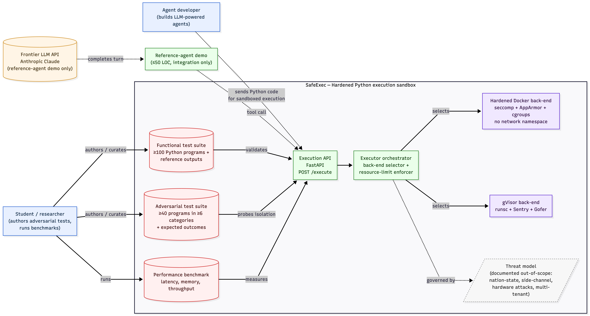

# Literature and Requirements Brief - SafeExec

> **AI-use disclosure.** Drafted with Codex (GPT-5, Codex desktop app) using public web sources and the existing CISC 699 repository artifacts. AI-drafted, student-revised. Key human-authored decisions to verify before Canvas submission: final source inclusion/exclusion, every requirement threshold, every acceptance-evidence mapping, and the advisor-review status. Full audit trail: [docs/ai-use-log.md](../ai-use-log.md).

## Document Control

| Field | Value |
|---|---|
| Document | CISC 699 Literature and Requirements Brief |
| Working title | SafeExec: A Hardened, Threat-Modeled Python Execution Sandbox for LLM-Agent Tool-Use |
| Student | Zixuan Liang (zliang1@my.harrisburgu.edu) |
| Program | M.S. Computer Information Sciences, Harrisburg University |
| Course | CISC 699-50-A-2026/Summer - Applied Project in Computer Information Sciences |
| Project advisor | Prof. Khalid Lateef |
| Course instructor | Dr. Majid Shaalan |
| Term | 2026-05-09 to 2026-08-14 |
| Assignment | 03 Literature and Requirements Brief |
| Brief version | 1.0 draft |
| Brief date | 2026-05-25 |
| Submission target | Sunday, 2026-05-31, before 11:59pm |
| Supersedes / refines | W1 annotated bibliography and W2 proposal scope |

## 1. Executive Synthesis

SafeExec addresses a narrow but increasingly important systems-security problem: LLM agents can now generate code, route it to tools, and receive execution results as part of an autonomous loop. In that loop, the code-execution layer is where generated text becomes real process execution. The literature and technical sources reviewed here converge on three claims. First, prompt injection, excessive agency, and unsafe output handling make LLM tool-use applications structurally exposed to hostile or malformed instructions [1], [2], [3]. Second, standard containers are useful isolation units but are not, by themselves, a complete answer to adversarial code execution; historical runc escapes and current runtime advisories show that container boundaries need explicit hardening, measured assumptions, and defense in depth [7], [8]. Third, stronger isolation approaches such as gVisor and Firecracker shift the attack surface and cost profile, which means SafeExec's evaluation must measure both containment and overhead rather than claim one backend is simply "better" [4], [5], [6], [9].

The resulting project fit is therefore not "build another code interpreter." OpenAI, Anthropic, E2B, and Modal already provide managed code-execution or sandbox products with richer production feature sets [10], [11], [12], [13]. The gap SafeExec targets is the absence of a small, reproducible, openly inspected artifact that ties a threat model, a requirements table, and an adversarial benchmark to two concrete isolation backends. SafeExec's contribution is a measurement-oriented sandbox: a `POST /execute` API for Python 3.11, a hardened-Docker backend, a gVisor backend, a functional corpus, a hand-authored adversarial corpus, and a benchmark harness that reports isolation and performance evidence.

This brief translates the literature into implementable requirements, use cases, constraints, and source/data decisions. The requirements below preserve the W2 approved scope: Python-only, single-tenant, no network egress, no GPU, ephemeral per-request filesystem, Linux x86_64 host, and two isolation backends unless the W7 midpoint review activates the documented fallback.

## 2. Source Strategy and Quality Screen

The source set was expanded from the W1 annotated bibliography into a W3 design source base. Sources were screened for authority, direct relevance, and actionability. "Authority" means official standards, peer-reviewed papers, primary project documentation, or upstream security advisories. "Direct relevance" means the source informs the SafeExec threat model, isolation design, evaluation method, or data/source inventory. "Actionability" means the source can be traced to at least one requirement, use case, constraint, or evaluation item.

| Theme | Source types | Included sources | How the sources are used |
|---|---|---|---|
| Agent/tool-use threats | Standards and security papers | NIST AI 100-2 E2025 [1], OWASP LLM Top 10 [2], Greshake et al. [3] | Threat categories, excessive agency framing, prompt-injection-to-tool-execution chain |
| Sandbox isolation primitives | Official docs and systems papers | gVisor security/performance docs [4], Linux seccomp-BPF docs [5], gVisor case study [6], Firecracker NSDI paper [9] | Backend architecture, syscall filtering, expected overhead and compatibility risks |
| Container escape evidence | Security advisories | Red Hat CVE-2019-5736 [7], GitHub/runc advisory for CVE-2024-21626 [8] | Adversarial-test categories and "default Docker is not enough" rationale |
| Existing code-execution products | Official product docs | OpenAI Code Interpreter [10], Anthropic code execution tool [11], E2B docs [12], Modal Sandboxes [13] | Product-gap analysis and API/user-experience expectations |
| Evaluation and reproducibility | Peer-reviewed papers, checklists, benchmark docs | SWE-bench [14], Pineau et al. [15], ML reproducibility checklist [16], HumanEval [17], MBPP [18] | Functional corpus design, execution-based grading, result reporting, source inventory |

The strongest sources for requirements are official or primary sources: NIST/OWASP for security framing, kernel/gVisor docs for isolation behavior, OpenAI/Anthropic/E2B/Modal docs for product expectations, and upstream benchmark/dataset repositories for functional-test reuse. News articles, vendor blogs, and secondary summaries were excluded unless they led to a primary source.

## 3. Literature Synthesis

### 3.1 LLM tool-use turns prompt risk into systems risk

NIST AI 100-2 E2025 frames adversarial machine learning using attacker goals, capabilities, knowledge, and lifecycle stage [1]. That taxonomy matters because SafeExec's adversary is not merely a malicious user typing shell commands; it may also be an indirect attacker whose instructions are embedded in content that an agent retrieves and interprets. OWASP's LLM Top 10 identifies the application-level risk in practical terms: prompt injection, improper output handling, and excessive agency become dangerous when model output is passed into downstream tools, APIs, interpreters, or operating systems without adequate controls [2].

Greshake et al. make the same point from a research-security angle. Their indirect-prompt-injection paper argues that LLM-integrated applications blur the boundary between data and instructions, enabling remote content to manipulate downstream tool calls [3]. For SafeExec, the relevant insight is not that a sandbox can prevent prompt injection. It cannot. The insight is that the executor should be designed as a last-resort containment boundary for the point where a compromised or confused agent attempts to execute code. This leads directly to requirements for no network egress, resource limits, expected-contained labels, audit logs, and a threat model that distinguishes upstream model manipulation from downstream process containment.

### 3.2 Containers are necessary but not sufficient for adversarial execution

Seccomp-BPF gives Linux processes a way to restrict incoming system calls using a BPF program over syscall number and arguments [5]. In hardened Docker, seccomp belongs alongside other controls: non-root users, read-only root filesystems, Linux capabilities reduction, cgroups, PID limits, file-descriptor limits, namespace isolation, and network denial. The literature does not support treating any one primitive as sufficient. Seccomp reduces syscall surface; cgroups limit resource consumption; namespaces separate views of filesystem/process/network state; AppArmor or another LSM can add mandatory access constraints. SafeExec should therefore specify Docker hardening as a policy bundle, not as "Docker default."

The CVE evidence reinforces that point. CVE-2019-5736 showed a runc container escape path involving overwrite of the host runtime binary, and Red Hat's advisory highlights mitigations such as running non-root containers and enforcing mandatory access control [7]. CVE-2024-21626 showed another runc escape class involving process working directory behavior and leaked file descriptors; the GitHub advisory points to runc 1.1.12 and related patches [8]. These are not requirements to reproduce public exploits. Instead, they justify adversarial categories such as host-path enumeration, `/proc` boundary probes, file-descriptor leakage checks, attempted persistence, and privilege/capability probes.

### 3.3 gVisor and Firecracker clarify the isolation-vs-overhead tradeoff

gVisor's own security model describes a userspace Sentry that intercepts application interactions with the host system API and provides its own implementation for much of that interface [4]. This is directly relevant to SafeExec's gVisor backend because the project is evaluating whether reducing direct host-kernel exposure improves containment against the adversarial corpus. gVisor documentation and the HotCloud case study both identify performance and compatibility costs, especially around system-call-heavy workloads, filesystem operations via Gofer, startup, memory, and network stack behavior [4], [6]. That evidence supports pre-registering the hypothesis that gVisor will have stronger containment but higher latency for short Python programs.

Firecracker is not in core scope, but it is still important literature. The NSDI paper frames microVMs as an attempt to combine VM-grade isolation with container-like startup and density for serverless workloads [9]. E2B's product documentation positions its agent sandboxes as fast, isolated VMs for agents [12], which makes Firecracker-style isolation the strongest practical point in the related-work landscape. SafeExec does not need to implement Firecracker to learn from it; Firecracker explains why a future extension may add a third backend and why the current two-backend comparison should report tradeoffs instead of universal claims.

### 3.4 Existing code-execution products set expectations but leave a reproducibility gap

OpenAI's Code Interpreter documentation states that the tool lets models run Python in a sandboxed environment and uses container objects, including configurable memory tiers [10]. Anthropic's code-execution tool documentation describes a Linux-based x86_64 environment with Python 3.11.12 and named CPU, memory, and disk resource limits [11]. E2B presents a fast, secure Linux VM created on demand for agents [12]. Modal Sandboxes describe running commands and untrusted code in managed sandboxes with readiness probes and explicit networking/security controls [13].

These products establish that sandboxed execution is now a normal agent-platform capability. They also show why SafeExec's scope should stay intentionally smaller. Managed products optimize for developer experience, cloud lifecycle, files, sessions, templates, and production APIs. SafeExec optimizes for a reproducible academic artifact: local source, documented assumptions, comparable backends, testable requirements, and an adversarial suite. The gap is therefore methodological, not feature-count-based.

### 3.5 Evaluation literature supports deterministic, execution-based evidence

SWE-bench is useful because it evaluates coding agents through real repository tests rather than subjective judgement [14]. HumanEval and MBPP provide smaller Python programming tasks with executable test cases, and HumanEval explicitly warns that untrusted generated code should be run only in a robust sandbox [17], [18]. Pineau et al. and the ML reproducibility checklist add process expectations: specify dependencies, evaluation code, exact number of runs, metrics, runtime, infrastructure, and result variability [15], [16].

SafeExec should therefore avoid "demo-only" evaluation. The W14 report should include deterministic functional results, adversarial contained/not-contained labels, benchmark sample sizes, confidence intervals, host details, command lines, and reproducibility notes. If gVisor is slower than Docker, that is not a failure; it is a measured tradeoff. If gVisor is not stronger on some category, that is also a valid finding if the method is transparent.

## 4. Gap Analysis

The reviewed sources agree on the need for sandboxing but do not provide a small, open, threat-model-linked benchmark for LLM-agent Python execution. Standards identify the risks, runtime documentation explains primitives, product docs show managed sandboxes, and evaluation papers show how to build reproducible test harnesses. The missing connection is an artifact that makes all four layers visible at once.

| Literature observation | Design implication | SafeExec gap response |
|---|---|---|
| LLM apps can turn untrusted text into tool actions [1], [2], [3] | Treat code execution as adversarial even when the user appears benign | Threat model + adversarial suite run through the same API as normal use |
| Default containers can fail under runtime vulnerabilities [7], [8] | Docker backend must be explicitly hardened and evaluated | Hardened Docker policy bundle and CVE-inspired adversarial categories |
| Stronger isolation changes cost and compatibility [4], [6], [9] | Measure containment and overhead together | Paired Docker vs gVisor benchmark with confidence intervals |
| Managed products exist but are opaque or cloud-dependent [10]-[13] | Academic artifact should favor reproducibility over product breadth | Local repo, pinned setup, small API, deterministic test harness |
| Benchmarks are credible when execution-based and reproducible [14]-[16] | Avoid subjective claims; store command lines and host details | Functional corpus, adversarial labels, benchmark scripts, result tables |

The project contribution is strongest when framed as "threat-modeled measurement of sandbox behavior for Python LLM-agent tool-use," not as a replacement for managed products or a new isolation primitive.

## 5. Use Cases and Operational Scenarios

The approved system context remains the controlling architecture for requirements. The same `/execute` endpoint is used by ordinary users, the demo agent, and the evaluation harness.

| Use case | Primary actor | Scenario | Success evidence |
|---|---|---|---|
| UC-1 Benign Python execution | Agent developer | Developer sends a small Python program to `POST /execute` and receives stdout, stderr, exit code, duration, and backend metadata | Functional test passes on Docker and gVisor |
| UC-2 Backend comparison | Student/researcher | Student runs the same functional corpus under both backends | Paired pass-rate table with mismatches explained |
| UC-3 Adversarial containment review | Student + advisor | Student runs adversarial corpus and reviews contained/not-contained outcomes by category | Category table, labels, and observed results |
| UC-4 Performance benchmark | Student/researcher | Student runs cold/warm/steady-state benchmark sweeps | Median, confidence interval, sample count, host metadata |
| UC-5 Reference-agent demo | Student | A minimal Claude-based agent invokes SafeExec for one synthetic coding/data task | Demo transcript and fallback recording; no API required for core tests |
| UC-6 Reproducibility check | Grader or portfolio reviewer | Reviewer clones repo on Ubuntu host and runs setup/test/bench commands | README commands complete or documented caveat reported |
| UC-7 Requirement audit | Advisor/instructor | Reviewer inspects how requirements trace to sources and evidence | Traceability matrix in this brief and final report appendix |

### User Stories

- As an agent developer, I want generated Python to run in an isolated environment so that a model mistake does not execute directly on my host.
- As a project reviewer, I want the same test suite to run under Docker and gVisor so that backend differences are measured on comparable workloads.
- As a security reviewer, I want adversarial programs labeled before execution so that the evaluation is not post-hoc storytelling.
- As the student, I want reproducible setup and benchmark commands so that the W14 report's claims can be checked by another reader.
- As the advisor, I want scope boundaries and fallback decisions visible before implementation so that W7 scope negotiation is disciplined.

## 6. Functional Requirements

| ID | Requirement | Rationale from literature/domain context | Acceptance evidence |
|---|---|---|---|
| FR-1 | Provide a synchronous HTTP `POST /execute` endpoint for Python 3.11 source code. | Product docs show code execution as an agent tool; single API keeps evaluation comparable [10], [11]. | API integration test returns stdout/stderr/exit/duration/backend fields. |
| FR-2 | Support two pluggable backends: hardened Docker and gVisor (`runsc`). | Literature frames a tradeoff between container hardening and application-kernel isolation [4]-[6]. | Same request executes successfully under both configured backends. |
| FR-3 | Enforce no outbound network access from executed code. | Prompt-injection literature identifies tool/API calls as a high-impact downstream path [2], [3]. | Adversarial network-egress tests fail contained with documented errors/timeouts. |
| FR-4 | Create an ephemeral per-request filesystem and discard it after execution. | Existing products support sandbox files, but SafeExec scope excludes persistent sessions [10]-[13]. | File-created-in-request is unavailable in subsequent request. |
| FR-5 | Apply resource limits for CPU, wall-clock time, memory, PIDs, and file descriptors. | Resource controls are required to contain denial-of-service attempts and benchmark repeatability [5], [16]. | Fork bomb, memory burn, fd exhaustion, and timeout tests are contained. |
| FR-6 | Return structured metadata for execution outcome and containment reason. | Deterministic evaluation needs machine-readable outputs [14]. | JSON schema test validates outcome, backend, limits, duration, and error category. |
| FR-7 | Maintain a functional test suite of at least 100 Python programs. | HumanEval/MBPP show executable-program testing patterns [17], [18]. | `make test-functional` reports >=99% pass rate per backend. |
| FR-8 | Maintain an adversarial suite of at least 40 programs across at least 6 categories. | CVE and prompt-injection sources motivate category coverage rather than ad hoc probes [2], [3], [7], [8]. | Suite manifest lists category, expected outcome, rationale, and observed outcome. |
| FR-9 | Provide a benchmark harness for cold-start, warm-start, and steady-state latency. | gVisor and Firecracker literature require reporting overhead, not only isolation [4], [6], [9]. | `make bench` emits CSV/JSON result tables with >=30 samples per condition. |
| FR-10 | Include a minimal reference-agent demo that uses SafeExec as a tool, without making external LLM access part of core evaluation. | Product context requires showing agent integration, while reproducibility should not depend on API availability [10], [11]. | Demo script and saved transcript; core tests pass without API key. |

## 7. Non-Functional Requirements

| ID | Requirement | Target / constraint | Acceptance evidence |
|---|---|---|---|
| NFR-1 | Reproducibility | A reader on Ubuntu 22.04/24.04 x86_64 can run documented setup/test/bench commands. | Clean-droplet log and README tested-command block. |
| NFR-2 | Functional correctness | >=99% pass rate on the functional corpus for each backend. | Per-backend test summary and mismatch table. |
| NFR-3 | Isolation effectiveness | Hardened Docker contains >=90% and gVisor contains >=95% of adversarial programs, unless W9 results justify a revised finding. | Adversarial result table by category and backend. |
| NFR-4 | Measurement rigor | Each benchmark condition uses >=30 samples and reports central tendency plus 95% confidence interval. | Benchmark output includes sample count and CI method. |
| NFR-5 | Scope discipline | Python-only, no network, no GPU, single-tenant, no persistent sessions. | README scope table, config defaults, and negative tests. |
| NFR-6 | Security hygiene | No secrets committed; demo API key read only from `.env`; adversarial tests target SafeExec only. | `.gitignore`, secret scan/manual check, engineering-log note. |
| NFR-7 | Documentation traceability | Every major requirement traces to at least one source and one acceptance artifact. | Traceability matrix in this brief and final report appendix. |
| NFR-8 | Accessibility and communication | Figures/tables have captions or surrounding explanation; report avoids color-only meaning. | Final report review checklist. |
| NFR-9 | Budget and hardware realism | Fits the existing DigitalOcean droplet class unless W7 fallback activates. | Engineering log records host inventory and benchmark host. |
| NFR-10 | AI-use compliance | Substantial AI assistance is disclosed per artifact and in final appendix. | Updated `docs/ai-use-log.md` and inline disclosure blocks. |

## 8. Domain Constraints and Assumptions

| Constraint area | Constraint | Impact on requirements |
|---|---|---|
| Machine | Primary runtime host is the existing DigitalOcean Premium Intel droplet: Ubuntu 22.04.5 LTS, x86_64, Docker 29.5.0, `runsc` release-20260511.0 as recorded in the W1 engineering log. | Official support target is Linux x86_64 only; macOS is authoring environment only. |
| Architecture | Single-tenant service; no production auth/TLS/rate limiting; no Kubernetes. | Security claims are about process containment on one controlled host, not production multitenancy. |
| Network | Sandbox code has no outbound network access. | Any benchmark or corpus requiring internet access is excluded or mocked. |
| Persistence | Per-request filesystem is ephemeral. | No session state, packages installed by user code, or persistent volumes in core scope. |
| Language/runtime | Python 3.11 only. | Functional suite and adversarial suite are Python programs; no Bash/JS/R support. |
| Data | No personal, FERPA, HIPAA, proprietary, or confidential data. | Evaluation uses public benchmark tasks, synthetic tasks, and student-authored probes. |
| Legal/licensing | Upstream corpus licenses must be recorded before vendoring or redistributing data. | Use hand-authored fallback if HumanEval/MBPP reuse creates ambiguity. |
| Ethics/security | Adversarial programs are dual-use. | Publish category taxonomy early; publish program details only as part of controlled project artifact with containment context. |
| Schedule | W7 is the sanctioned scope-negotiation point. | If backend work slips, advisor-approved fallback can drop gVisor and preserve benchmark/adversarial contribution. |
| API dependency | Anthropic API is demo-only. | No core requirement depends on cloud LLM availability. |

## 9. Candidate Data and Source Inventory

SafeExec is not data-driven in the machine-learning sense, but it depends on program corpora and benchmark outputs. These are treated as data sources for provenance and reproducibility.

| Source / dataset | Type | Provenance | Fields / structure | Quality concerns | Decision |
|---|---|---|---|---|---|
| HumanEval | Functional programming tasks | OpenAI GitHub repository and associated paper [17] | Task ID, prompt, canonical solution, tests | The repository warns that model-generated code is untrusted; license and exact reuse terms must be preserved. | Candidate seed for functional tests; use subset only after license file is recorded. |
| MBPP | Functional programming tasks | Google Research repository [18] | JSONL tasks with prompt, code solution, tests, train/validation/test split | Crowd-sourced tasks may be simpler than realistic agent code; license/provenance must be carried. | Optional functional seed; not required if hand-authored suite reaches 100. |
| Student-authored functional tests | Functional correctness | Authored in repo | Python source, expected stdout/stderr/exit, category | Risk of shallow coverage unless categories are reviewed. | Required; should cover stdlib, files, imports, errors, timeouts. |
| Student-authored adversarial tests | Security evaluation | Authored in repo from threat categories and CVE-inspired behaviors | Program ID, category, expected-contained label, rationale, backend outcomes | Dual-use and overfitting risks; avoid copying exploit code. | Required central contribution; program-level AI-use disclosure if AI assists. |
| Benchmark measurements | Performance/reproducibility evidence | Generated by `make bench` on named hosts | Backend, program ID, cold/warm flag, duration, memory, exit, timestamp, host metadata | Host variability and warm-cache effects. | Required; report medians, CIs, and host specs. |
| Demo transcript | Communication evidence | Generated from reference-agent demo | Prompt, tool call, SafeExec response, final answer | Model/API variability and cost. | Optional supporting artifact; not core evaluation. |

## 10. Requirements Traceability Matrix

| Requirement | Primary sources | Implementation artifact | Evaluation / evidence |
|---|---|---|---|
| FR-1 API endpoint | [10], [11], [12], [13] | `src/api/` | API integration tests |
| FR-2 two backends | [4], [5], [6] | `src/backends/docker_hardened/`, `src/backends/gvisor/` | Paired functional/adversarial results |
| FR-3 no network | [2], [3], [13] | Docker/gVisor network config | Network-egress adversarial tests |
| FR-4 ephemeral filesystem | [10], [11], [12] | Executor lifecycle | Persistence negative tests |
| FR-5 resource limits | [5], [11], [16] | cgroup/ulimit/timer controls | Resource-exhaustion tests |
| FR-6 structured outcome metadata | [14], [16] | Response schema | JSON-schema tests |
| FR-7 functional suite | [14], [17], [18] | `tests/functional/` | >=99% pass-rate report |
| FR-8 adversarial suite | [1], [2], [3], [7], [8] | `tests/adversarial/` | Containment table by category |
| FR-9 benchmark harness | [4], [6], [9], [15], [16] | `benchmarks/` | >=30-sample benchmark tables |
| FR-10 reference-agent demo | [10], [11], [12], [13] | `scripts/demo_agent.py` | Demo transcript/recording |
| NFR-1 reproducibility | [15], [16] | `README.md`, `Makefile`, `deploy/setup.sh` | Clean-host run log |
| NFR-3 isolation targets | [2], [4], [7], [8] | Backend hardening config | Contained-outcome rate |
| NFR-10 AI-use compliance | Course policy and W1 feedback | `docs/ai-use-log.md` | Final AI-use appendix |

## 11. Advisor Review Checklist

The following items should be reviewed with Prof. Khalid Lateef before implementation details harden in W4:

1. Confirm that the narrowed scope remains acceptable: Python-only, no network, no GPU, single-tenant, Linux x86_64.
2. Confirm that the adversarial-suite contribution is framed as a defensive benchmark and not as exploit publication.
3. Confirm that the W7 fallback remains acceptable if gVisor integration slips.
4. Review whether the functional corpus should use HumanEval/MBPP subsets or remain fully hand-authored.
5. Review numeric thresholds for contained-outcome rates and benchmark sample counts.
6. Identify any missing domain constraints before `docs/design/architecture.md`, `threat-model.md`, and `evaluation-plan.md` are written in W4.

## 12. AI-Use and Academic Integrity Note

This brief was prepared with AI assistance and must not be submitted as unaided work. Codex helped synthesize the source set, structure the requirements tables, and draft prose. The student remains responsible for source verification, requirements acceptance, final edits, Canvas submission, and all project decisions. No confidential, personal, FERPA-regulated, HIPAA-regulated, proprietary, or restricted data was provided to the AI tool. Public course assignment text, public web sources, and repository artifacts were used.

The final report should include this W3 work in the AI-use appendix and should preserve the distinction between AI-assisted documentation and student-authored implementation/evaluation decisions. Any future AI assistance on the adversarial suite must be logged at program level because the suite is the project's central intellectual contribution.

## References

[1] A. Vassilev, A. Oprea, A. Fordyce, H. Anderson, X. Davies, and M. Hamin, *Adversarial Machine Learning: A Taxonomy and Terminology of Attacks and Mitigations*, NIST Trustworthy and Responsible AI Report AI 100-2 E2025, National Institute of Standards and Technology, 2025. Available: https://csrc.nist.gov/pubs/ai/100/2/e2025/final

[2] OWASP Foundation, *OWASP Top 10 for Large Language Model Applications*, OWASP Gen AI Security Project, latest public project page and v2025 materials. Available: https://owasp.org/www-project-top-10-for-large-language-model-applications/

[3] K. Greshake, S. Abdelnabi, S. Mishra, C. Endres, T. Holz, and M. Fritz, "Not what you've signed up for: Compromising Real-World LLM-Integrated Applications with Indirect Prompt Injection," arXiv:2302.12173, 2023. Available: https://arxiv.org/abs/2302.12173

[4] The gVisor Authors, "Security Model," *gVisor Documentation*. Available: https://gvisor.dev/docs/architecture_guide/security/

[5] The Linux Kernel documentation, "Seccomp BPF (SECure COMPuting with filters)." Available: https://cdn.kernel.org/doc/html/latest/userspace-api/seccomp_filter.html

[6] E. G. Young, P. Zhu, T. Caraza-Harter, A. C. Arpaci-Dusseau, and R. H. Arpaci-Dusseau, "The True Cost of Containing: A gVisor Case Study," *USENIX HotCloud '19*, 2019. Available: https://www.usenix.org/conference/hotcloud19/presentation/young

[7] Red Hat Product Security, "runc - Malicious container escape - CVE-2019-5736," Red Hat Customer Portal, 2019. Available: https://access.redhat.com/security/vulnerabilities/runcescape

[8] GitHub Advisory Database, "runc vulnerable to container breakout through process.cwd trickery and leaked fds - CVE-2024-21626," GHSA-xr7r-f8xq-vfvv, 2024. Available: https://github.com/advisories/GHSA-xr7r-f8xq-vfvv

[9] A. Agache et al., "Firecracker: Lightweight virtualization for serverless applications," *Proc. 17th USENIX NSDI*, 2020. Available: https://www.usenix.org/conference/nsdi20/presentation/agache

[10] OpenAI, "Code Interpreter," *OpenAI API Documentation*. Available: https://developers.openai.com/api/docs/guides/tools-code-interpreter

[11] Anthropic, "Code execution tool," *Claude API Documentation*. Available: https://platform.claude.com/docs/en/agents-and-tools/tool-use/code-execution-tool

[12] E2B, "E2B Documentation." Available: https://www.e2b.dev/docs

[13] Modal, "Sandboxes," *Modal Documentation*. Available: https://modal.com/docs/guide/sandboxes

[14] C. E. Jimenez et al., "SWE-bench: Can Language Models Resolve Real-World GitHub Issues?," *ICLR 2024*. Available: https://proceedings.iclr.cc/paper_files/paper/2024/file/edac78c3e300629acfe6cbe9ca88fb84-Paper-Conference.pdf

[15] J. Pineau et al., "Improving Reproducibility in Machine Learning Research (A Report from the NeurIPS 2019 Reproducibility Program)," arXiv:2003.12206, 2020. Available: https://arxiv.org/abs/2003.12206

[16] J. Pineau, "The Machine Learning Reproducibility Checklist," v2.0, 2020. Available: https://www.cs.mcgill.ca/~jpineau/ReproducibilityChecklist.pdf

[17] OpenAI, "HumanEval: Hand-Written Evaluation Set," GitHub repository. Available: https://github.com/openai/human-eval

[18] Google Research, "Mostly Basic Python Problems Dataset," GitHub repository. Available: https://github.com/google-research/google-research/tree/master/mbpp
