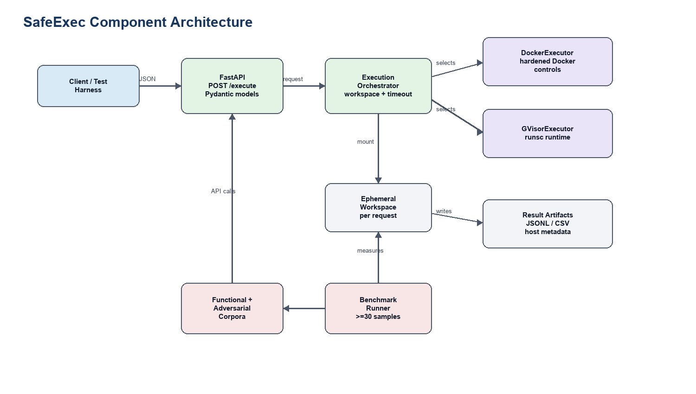
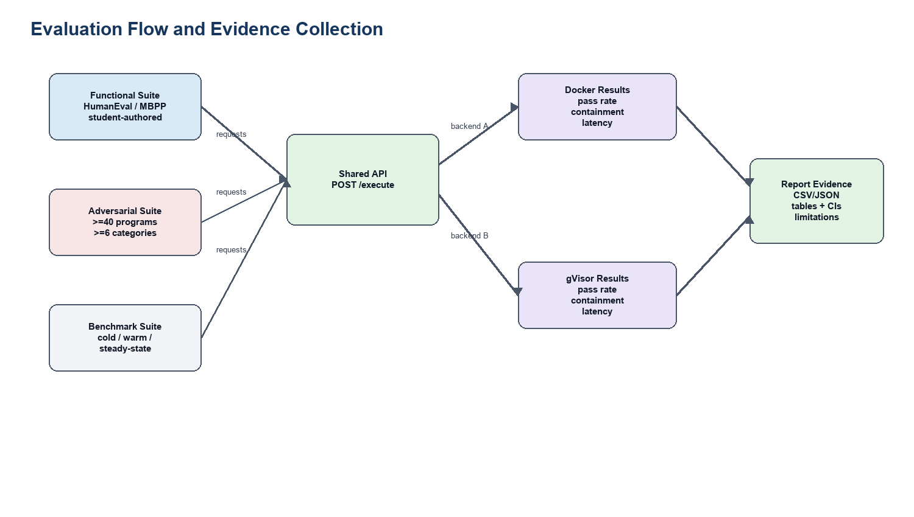

# Design Review Package - SafeExec

> **AI-use disclosure.** Drafted with Codex (GPT-5, Codex desktop app) from the approved W2 proposal, W3 literature/requirements brief, and W2 feedback. AI-drafted, student-revised. Key human-authored decisions carried into this document: Python-only scope, no-network/no-GPU/no-persistence boundaries, Docker-first build order, gVisor W7 fallback, HumanEval/MBPP subset use, adversarial taxonomy disclosure timing, and all success thresholds. Full audit trail: [docs/ai-use-log.md](../ai-use-log.md).

## Document Control

| Field | Value |
|---|---|
| Document | CISC 699 Hard Stop 2: Design Review Package |
| Working title | SafeExec: A Hardened, Threat-Modeled Python Execution Sandbox for LLM-Agent Tool-Use |
| Student | Zixuan Liang (zliang1@my.harrisburgu.edu) |
| Program | M.S. Computer Information Sciences, Harrisburg University |
| Course | CISC 699-50-A-2026/Summer - Applied Project in Computer Information Sciences |
| Project advisor | Prof. Khalid Lateef |
| Course instructor | Dr. Majid Shaalan |
| Term | 2026-05-09 to 2026-08-14 |
| Assignment | 04 Hard Stop 2: Design Review Package |
| Package version | 1.0 design-review draft |
| Package date | 2026-05-30 |
| Submission target | Sunday, 2026-06-07, before 11:59pm |
| Source inputs | W2 proposal approval package, W3 literature/requirements brief, W2 approval feedback |

## 1. Design Review Summary

SafeExec will be implemented as a small synchronous Python execution service with a single external API and two internal executor backends: hardened Docker first, then gVisor through `runsc`. The design goal is not product breadth; it is a reproducible, threat-modeled comparison of isolation behavior and overhead for Python 3.11 code executed on behalf of LLM-agent workflows.

The W2 feedback approved the concept and named execution risk as the main concern. This package responds by freezing optional scope and making the W5-W8 build path explicit. The implementation starts with a minimal `POST /execute` path that can run "hello world" through Docker, then hardens resource and filesystem controls, then grows the test harness and adversarial taxonomy, and only then integrates gVisor. Every design choice below preserves the W3 requirements and success criteria.

**Primary design decision.** All functional tests, adversarial tests, benchmarks, and the reference-agent demo call the same `POST /execute` API. This prevents the evaluation harness from becoming a separate special path and makes Docker-vs-gVisor comparisons methodologically clean.

## 2. Requirements-to-Design Traceability

| Requirement | Design decision | Evidence planned |
|---|---|---|
| FR-1 `POST /execute` API | FastAPI endpoint with Pydantic request/response models. | API integration test and OpenAPI schema snapshot. |
| FR-2 Docker + gVisor backends | Executor interface with `DockerExecutor` and `GVisorExecutor` implementations. | Same request executed under both backends. |
| FR-3 No network egress | Docker network mode `none`; gVisor uses same no-network container configuration. | Network-egress adversarial tests return contained outcome. |
| FR-4 Ephemeral filesystem | Per-request workspace mounted into a short-lived container; workspace deleted after run. | Persistence negative test across two requests. |
| FR-5 Resource limits | CPU, wall-clock, memory, PID, and file-descriptor limits enforced at executor/supervisor layer. | Fork/memory/fd/time-limit adversarial tests. |
| FR-6 Structured metadata | Response includes stdout, stderr, exit code, timeout flag, backend, duration, limit snapshot, and error category. | JSON schema validation. |
| FR-7 Functional suite >=100 | HumanEval/MBPP subsets plus student-authored tests with exact expected outputs. | `make test-functional`; >=99% pass per backend. |
| FR-8 Adversarial suite >=40 / >=6 categories | Manifest-driven adversarial tests with pre-registered expected-contained labels. | Category coverage audit and contained-outcome report. |
| FR-9 Benchmark harness | Shared benchmark runner against the API; >=30 samples per backend/condition. | CSV/JSON results with medians and 95% confidence intervals. |
| FR-10 Reference-agent demo | Small script invokes API as a tool; demo is not part of core evaluation. | Demo transcript; core tests pass with no API key. |

## 3. Architecture and Component Responsibilities



| Component | Responsibility | Implementation notes |
|---|---|---|
| API layer | Accept requests, validate payloads, select backend, return structured response. | FastAPI route `POST /execute`; Pydantic request/response models. |
| Execution orchestrator | Creates request ID, prepares workspace, enforces wall-clock timeout, calls selected executor, collects metrics, cleans up. | One internal service class so test harness and API use identical behavior. |
| Executor interface | Stable contract for all backends: `execute(request, workspace) -> ExecutionResult`. | Enables Docker-first implementation without changing later gVisor tests. |
| Docker executor | Runs Python inside hardened Docker container with no network, non-root user, read-only root filesystem, tmpfs/workspace mount, dropped capabilities, cgroups and ulimits. | W5 baseline, W6 hardening. |
| gVisor executor | Runs the same image/configuration through Docker runtime `runsc`, preserving API and test harness. | W8 target; W7 fallback if integration risk materializes. |
| Evaluation harness | Loads functional/adversarial manifests, maps tests to API requests, stores JSONL/CSV outputs, and records host metadata. | Supports HumanEval/MBPP subset IDs, student-authored programs, and reproducible benchmark tables. |
| Reference-agent demo | Optional integration evidence showing an LLM-agent-style tool call. | Demo-only; no grading claim depends on live API provider availability. |

### Build Order

1. W5: API skeleton, request/response models, `DockerExecutor` baseline, first hello-world request.
2. W5-W6: functional-corpus loader and exact-output runner.
3. W6: Docker hardening bundle: no network, non-root, read-only root, dropped caps, no-new-privileges, cgroup/ulimit controls.
4. W6-W7: adversarial manifest and first 20 tests across at least 3 categories.
5. W7: midpoint demo and explicit fallback decision; taxonomy locked at category level.
6. W8: `GVisorExecutor` through `runsc`; run full functional/adversarial/benchmark harness against both backends.

## 4. Execution Flow and Data Flow

The execution path is deliberately short so failure modes are observable.

1. Client submits `POST /execute` with Python source, backend choice, and optional limit overrides within configured caps.
2. API validates request size, backend name, timeout cap, and language (`python3.11` only).
3. Orchestrator creates a request ID and ephemeral workspace under the host temp root.
4. Selected executor writes source to the workspace and starts a short-lived container with configured isolation controls.
5. Supervisor timer enforces wall-clock limit; Docker/gVisor/cgroup controls enforce process and memory boundaries.
6. Executor captures stdout, stderr, exit code, timeout status, duration, and resource-limit snapshot.
7. Orchestrator deletes the workspace and returns a structured response.
8. Test/benchmark runners persist only summary metadata and outputs needed for reproducibility; no user data is processed.

## 5. API Contract

| Item | Design |
|---|---|
| Endpoint | `POST /execute` |
| Content type | `application/json` |
| Language support | `python3.11` only |
| Backends | `docker_hardened`, `gvisor` |
| Max source size | Initial cap 64 KiB; can be lowered if resource tests show abuse risk. |
| Default limits | Wall-clock 2s, memory 256 MiB, CPU 1 vCPU equivalent, PIDs 64, file descriptors 64. |
| Response status | HTTP 200 for contained execution, HTTP 4xx for validation errors, HTTP 5xx for service failure. |

### Sample Request

```json
{
  "code": "print(sum(range(10)))",
  "language": "python3.11",
  "backend": "docker_hardened",
  "limits": {
    "wall_time_ms": 2000,
    "memory_mb": 256
  }
}
```

### Sample Response

```json
{
  "request_id": "req_20260606_000001",
  "backend": "docker_hardened",
  "status": "completed",
  "exit_code": 0,
  "stdout": "45\n",
  "stderr": "",
  "duration_ms": 184,
  "timed_out": false,
  "error_category": null,
  "limits_applied": {
    "wall_time_ms": 2000,
    "memory_mb": 256,
    "pids": 64,
    "nofile": 64,
    "network": "disabled"
  }
}
```

## 6. Computational Method and Isolation Design

### Hardened Docker Backend

The Docker backend is both the baseline and the first implementation target. It will use a minimal Python image, non-root execution, no network namespace, read-only root filesystem, an ephemeral writable workspace, dropped Linux capabilities, `no-new-privileges`, PID and file descriptor caps, cgroup memory/CPU limits, and a seccomp profile. AppArmor will be enabled if the target host supports it without delaying W5-W6 build milestones.

The backend is considered "hardened" only when its configuration is visible in source (`deploy/`, `src/backends/docker_hardened/`) and is exercised by negative tests. "Default Docker" is not an acceptable implementation state beyond the first W5 smoke test.

### gVisor Backend

The gVisor backend reuses the same request schema, image, source-writing flow, limits, and test harness, but changes the container runtime to `runsc`. The purpose is to evaluate whether reducing direct host-kernel exposure improves adversarial containment enough to justify overhead. Compatibility differences are recorded as findings, not silently papered over.

### Contained Outcome Semantics

An adversarial test is "contained" when it terminates, times out, or fails with an expected sandbox error without affecting the host, the service process, another request, the network, or persistent state. It is "not contained" if it writes outside the workspace, performs network egress, escapes configured limits, affects a later request, or exposes host-only state beyond the allowed sandbox view.

## 7. Environment, Toolchain, and Dependency Plan

| Layer | Planned choice | Evidence / file |
|---|---|---|
| Authoring host | macOS laptop with PyCharm; GitHub remote for version control. | README and engineering log. |
| Runtime host | DigitalOcean Premium Intel droplet, NYC3, 2 vCPU / 4 GB / 120 GB NVMe, Ubuntu 22.04.5 LTS, kernel 5.15.0-179-generic. | W1 engineering-log inventory. |
| Container runtime | Docker 29.5.0, `runsc` release-20260511.0 already verified on droplet. | `deploy/setup.sh` and host inventory. |
| Python | Python 3.11 for service and sandboxed code. | `.python-version` or README tested-platforms section. |
| API framework | FastAPI + Uvicorn, pinned in `requirements.txt` during W5. | `requirements.txt` / lockfile. |
| Testing | `pytest`, JSON schema validation, shell smoke tests. | `tests/` and CI-equivalent command output. |
| Benchmarking | API benchmark runner with CSV/JSON output; optional `pytest-benchmark` or `hyperfine` only if it does not complicate reproducibility. | `benchmarks/` and result tables. |
| Data/corpora | HumanEval subset, MBPP subset, student-authored functional tests, student-authored adversarial tests. | Manifest files with source, license, and task IDs. |
| Secrets | Demo API key only in `.env`, gitignored. | `.gitignore`, README, secret check before final. |

### Dependency Strategy

The dependency posture is intentionally boring: pin only what the artifact needs, avoid optional orchestration layers, and keep a single setup path. W5 will add `requirements.txt`, a lockfile if time permits, `deploy/setup.sh`, and a `Makefile` with `make setup`, `make test`, and `make bench`. The clean-VM reproducibility test in W10 is the final authority on whether the dependency story is acceptable.

## 8. Data, Corpus, and Validation Plan

SafeExec is not training a model, so there is no train/test split in the ML sense. The relevant data artifacts are program corpora and measurement outputs.

| Artifact | Validation rule | Bias/error check |
|---|---|---|
| HumanEval subset | Record task IDs, license notice, expected output/tests, and any modifications. | Avoid overrepresenting short algorithmic tasks by adding stdlib/file/error cases. |
| MBPP subset | Record task IDs, license/provenance, and expected outputs/tests. | Check overlap with HumanEval categories; do not count near-duplicates twice. |
| Student-authored functional tests | Each test has source, expected stdout/stderr/exit code, category, and deterministic seed if relevant. | Review category coverage: arithmetic, imports, files, exceptions, timeouts, stdout/stderr. |
| Student-authored adversarial tests | Each test has category, expected-contained outcome, rationale, and allowed error modes. | Avoid copying public exploit code; categorize by behavior, not CVE proof-of-concept replication. |
| Benchmark outputs | Include backend, host metadata, sample count, cold/warm flag, duration, memory, exit status, timestamp. | Report medians and 95% confidence intervals; flag host changes. |

Adversarial categories for W7 lock: resource exhaustion, PID/fork exhaustion, file-descriptor exhaustion, filesystem persistence/escape attempts, host enumeration, syscall/capability abuse, and network-egress attempts. The target remains at least 40 programs across at least 6 categories by W8.

## 9. Testing and Evaluation Design



| Test type | Purpose | Metric | Acceptance threshold | Evidence |
|---|---|---|---|---|
| Unit tests | Validate request models, limit parsing, workspace cleanup, executor interface. | Pass/fail. | 100% for core utility functions. | `pytest tests/unit`. |
| API integration tests | Validate `POST /execute` behavior and schema. | Pass/fail; schema match. | All core API tests pass. | `pytest tests/integration`. |
| Functional suite | Confirm benign Python executes correctly. | Pass rate per backend. | >=99% of >=100 programs per backend. | Functional result table. |
| Adversarial suite | Measure containment behavior. | Contained-outcome rate by backend/category. | Docker >=90%; gVisor >=95%; null results reported. | Adversarial manifest + result table. |
| Performance benchmark | Measure overhead and tradeoff. | Median duration, 95% CI, memory, overhead ratio. | >=30 samples per backend/condition; report, not pass/fail. | Benchmark CSV/JSON + plots. |
| Reproducibility run | Confirm another clean host can run the artifact. | Setup time, command success, numeric agreement. | `make setup && make test && make bench`; numbers within +/-10% on equivalent hardware. | W10 clean-host log. |

### Benchmark Protocol

Each backend/condition pair gets at least 30 measured samples after warm-up. Conditions are cold-start, warm-start, and steady-state short-program execution. Results report median, interquartile range, and 95% confidence interval for median or mean as appropriate. The report will include host metadata, Docker/runsc versions, exact command lines, and any excluded samples with reasons.

### Baselines and Comparisons

The main comparison is hardened Docker vs gVisor through the same API and test corpus. CPython on the host is used only as a reference-output generator for functional correctness, not as a security baseline. E2B/OpenAI/Anthropic/Modal are related-work context, not benchmark targets, because their infrastructure is managed and not methodologically comparable inside this academic artifact.

## 10. Implementation-Risk Controls

| Risk | Early signal | De-risk action | Fallback |
|---|---|---|---|
| Docker API path slips | No hello-world via `POST /execute` by 2026-06-12. | Cut optional docs, implement smallest Docker executor path. | Combine W5/W6, report delay. |
| Docker hardening becomes unstable | Functional tests pass only with weak/default Docker settings. | Add hardening controls one at a time with negative tests. | Document unsupported control and preserve strongest stable set. |
| Adversarial suite grows too slowly | Fewer than 20 adversarial programs by W7. | Prioritize category coverage over clever edge cases. | Ship fewer tests per category but keep >=6 categories. |
| gVisor integration slips | `runsc` cannot run API path by W7 midpoint. | Keep same executor interface; isolate runtime-specific debugging. | Drop gVisor at W7 and reframe evaluation around Docker hardening variants. |
| Benchmark variability is high | Wide confidence intervals or host noise. | Increase samples, separate cold/warm, record host metadata. | Report variability as finding; avoid overclaiming. |

## 11. Review Checklist for W4 Approval

The advisor/instructor should be able to approve the following before W5 implementation accelerates:

1. Component boundaries are clear enough to build without inventing new scope.
2. Docker-first build order and gVisor fallback are acceptable.
3. `POST /execute` request/response contract is sufficient for tests and demo.
4. Environment/toolchain plan is reproducible and not overcomplicated.
5. Adversarial contained-outcome definition is specific enough to prevent post-hoc scoring.
6. Benchmark protocol is measurable and aligned to the W2/W3 success criteria.
7. W5 execution target is concrete: first hello-world request through API and Docker backend.

## 12. AI-Use and Academic Integrity Note

Codex assisted in drafting this design package, selecting document structure, generating diagrams, and producing the DOCX/PDF artifacts. The student remains responsible for correctness, source verification, final edits, and all implementation decisions. No confidential, personal, FERPA-regulated, HIPAA-regulated, proprietary, or restricted data was provided to the AI tool. This use is logged in `docs/ai-use-log.md`.

## References

[1] National Institute of Standards and Technology, *Adversarial Machine Learning: A Taxonomy and Terminology of Attacks and Mitigations*, NIST AI 100-2 E2025, 2025. https://csrc.nist.gov/pubs/ai/100/2/e2025/final

[2] OWASP Foundation, *OWASP Top 10 for Large Language Model Applications*. https://owasp.org/www-project-top-10-for-large-language-model-applications/

[3] The gVisor Authors, "Security Model," *gVisor Documentation*. https://gvisor.dev/docs/architecture_guide/security/

[4] Linux Kernel Documentation, "Seccomp BPF (SECure COMPuting with filters)." https://cdn.kernel.org/doc/html/latest/userspace-api/seccomp_filter.html

[5] E. G. Young et al., "The True Cost of Containing: A gVisor Case Study," USENIX HotCloud '19, 2019. https://www.usenix.org/conference/hotcloud19/presentation/young

[6] C. E. Jimenez et al., "SWE-bench: Can Language Models Resolve Real-World GitHub Issues?," ICLR 2024. https://proceedings.iclr.cc/paper_files/paper/2024/file/edac78c3e300629acfe6cbe9ca88fb84-Paper-Conference.pdf

[7] OpenAI, "HumanEval: Hand-Written Evaluation Set." https://github.com/openai/human-eval

[8] Google Research, "Mostly Basic Python Problems Dataset." https://github.com/google-research/google-research/tree/master/mbpp
